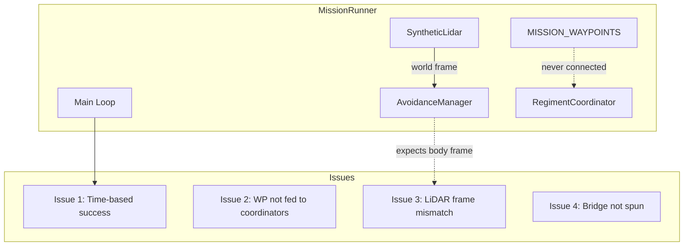

# Simulation Codebase Issues — Senior Developer Analysis

This plan documents potential issues in the simulation stack that affect mission success. Issues are ordered by severity (Critical → High → Medium → Low).

---

## Critical Issues

### 1. Mission Success Based on Time, Not Waypoint Completion

**Location:** [scripts/isaac_sim/run_mission.py](scripts/isaac_sim/run_mission.py) lines 416–418

```python
if elapsed >= self._mission_success_duration:
    mission_result = "SUCCESS"
    break
```

The mission is marked **SUCCESS** after 120 seconds regardless of whether any waypoints are reached. Mission logs show drones barely moving from formation center (400, 350) before timeout. The intended behavior should be: mission succeeds when all 11 waypoints are traversed (or a defined subset).

**Impact:** Mission “success” does not validate obstacle avoidance or waypoint navigation.

---

### 2. Mission Waypoints Never Fed to Coordinators

**Location:** [scripts/isaac_sim/run_mission.py](scripts/isaac_sim/run_mission.py) main loop vs. [src/swarm/coordination/regiment_coordinator.py](src/swarm/coordination/regiment_coordinator.py)

`MISSION_WAYPOINTS` (Downtown, Industrial, Forest, Powerline corridor) are stored in `_mission_waypoints` but **never passed** to `AlphaRegimentCoordinator` or `FlockCoordinator`. Coordinators use sector-based sweep waypoints from `_assign_sectors()` (centered on `total_coverage_area/2`), not the obstacle-course waypoints.

**Impact:** Drones follow generic sector coverage, not the intended obstacle-course path. The mission does not exercise the designed waypoint sequence.

---

### 3. Synthetic LiDAR Frame Mismatch (Body vs. World)

**Location:** [scripts/isaac_sim/run_mission.py](scripts/isaac_sim/run_mission.py) `SyntheticLidar.scan()` vs. [src/single_drone/sensors/lidar_3d.py](src/single_drone/sensors/lidar_3d.py) `Lidar3DDriver.update_points()`

- `SyntheticLidar.scan()` returns hit points in **world frame** (NED).
- `Lidar3DDriver` expects points in **body frame** (x=forward, y=left, z=up).
- In `_cluster_obstacles()`, the driver adds `drone_position` to cluster centers assuming body frame. With world-frame input, obstacle positions are wrong (double offset).

**Impact:** Obstacle positions fed to APF are incorrect; avoidance behavior is unreliable.

---

### 4. Isaac Sim Bridge Never Spun (ROS 2)

**Location:** [scripts/isaac_sim/run_mission.py](scripts/isaac_sim/run_mission.py) `_init_bridge()` and `_publish_velocity()`

The `IsaacSimBridgeNode` is created but `rclpy.spin()` is never called. Velocity commands are published via `send_velocity()`, but without spinning the node, the executor does not process callbacks and messages may not be sent reliably.

**Note:** Stage sync overwrites drone positions directly, so visualization may still work. The bridge is intended for physics-driven control; the current setup uses kinematic overwrites, so the bridge role is unclear and possibly redundant.

---

## High Severity Issues

### 5. Obstacle Database Drift Risk

**Location:** [scripts/isaac_sim/run_mission.py](scripts/isaac_sim/run_mission.py) `_load_obstacle_database()` vs. [scripts/isaac_sim/create_surveillance_scene.py](scripts/isaac_sim/create_surveillance_scene.py)

Obstacle definitions are duplicated. Industrial zone uses different structures (scene: dict with `elev`; runner: 6-tuple). Residential and forest use `np.random.RandomState(42)` and `(77)` — same seeds, but any change in one file can desync the other.

**Recommendation:** Single source of truth (e.g., shared module or config) for obstacle geometry.

---

### 6. Simulation Server Pause Toggle Logic

**Location:** [scripts/simulation_server.py](scripts/simulation_server.py) line 443

```python
def pause(self):
    self.is_running = not self.is_running  # Toggles instead of pausing
```

`pause()` toggles `is_running` instead of forcing pause. A “Pause” button can resume the simulation.

---

### 7. Waypoint Controller Path Uses Single Drone Only

**Location:** [scripts/isaac_sim/run_mission.py](scripts/isaac_sim/run_mission.py) `_run_waypoint_controller_path()`

With `--controller-path`, only `FlightController(drone_id=0)` is used. The mission is defined for 6 drones, but only one is controlled.

---

### 8. Hex Formation: 5 Vertices + Center, Not Full Hexagon

**Location:** [src/core/utils/geometry.py](src/core/utils/geometry.py) `hex_positions(n=6)`

With `n=6`, the function returns center + 5 vertices (angles 0°, 60°, …, 240°). A full hexagon would have 6 vertices. This may be intentional but is inconsistent with the docstring (“center plus up to 6 surrounding positions”).

---

## Medium Severity Issues

### 9. SimDrone Ignores Velocity Dynamics

**Location:** [scripts/isaac_sim/run_mission.py](scripts/isaac_sim/run_mission.py) `SimDrone.step()`

```python
self.velocity = velocity_command  # Instant velocity, no dynamics
self.position = Vector3(...)      # Direct integration
```

Velocity is set directly with no acceleration limits or dynamics. Real drones have inertia and rate limits; this can make simulated behavior optimistic.

---

### 10. Collision Detection Uses AvoidanceManager State

**Location:** [scripts/isaac_sim/run_mission.py](scripts/isaac_sim/run_mission.py) lines 378–391

Collision is inferred from `mgr.closest_obstacle_distance < 0.5`. There is no explicit geometric collision check between drone positions and obstacles. If LiDAR misses an obstacle (e.g., due to frame or clustering issues), collisions may go undetected.

---

### 11. Simulation Server HTML Path Assumption

**Location:** [scripts/simulation_server.py](scripts/simulation_server.py) line 663

```python
HTML_FILE = os.path.join(os.path.dirname(__file__), '..', 'drone_visualization_live.html')
```

Assumes the script is run from `scripts/` and that `drone_visualization_live.html` is in the project root. Running from another directory can break the path.

---

### 12. Mission Overlay advance_waypoint Never Called

**Location:** [scripts/isaac_sim/create_surveillance_scene.py](scripts/isaac_sim/create_surveillance_scene.py) `MissionOverlay.advance_waypoint()`

`advance_waypoint()` exists but is never invoked by `run_mission.py`. The overlay’s waypoint progress stays at 0.

---

### 13. Fault Injection: clear_fault Does Not Reset All Fault Types

**Location:** [scripts/simulation_server.py](scripts/simulation_server.py) `SimulatedDrone.clear_fault()`

Only `COMMS_LOSS` and `is_failed` without `failure_reason` are cleared. `MOTOR_FAILURE`, `TOTAL_POWER_LOSS`, `BATTERY_CRITICAL`, and `GPS_LOSS` are not reset, so a “cleared” drone can remain in a faulted state.

---

## Low Severity / Code Quality

### 14. Inconsistent Drone Naming (Case)

**Locations:** `run_mission.py` uses `alpha_{id}`; `create_surveillance_scene.py` uses `Alpha_{id}`; config uses `alpha_0`. The lidar hook parses `Alpha_0` → 0. Case handling is brittle.

---

### 15. Duplicate run_mission Entry Point Logic

**Location:** [scripts/isaac_sim/run_mission.py](scripts/isaac_sim/run_mission.py) lines 678–688

When loaded via Isaac Sim Script Editor, the `else` block creates a runner and schedules `run()`. If an event loop already exists, this can conflict with other async usage.

---

### 16. AvoidanceManager get_telemetry Key Mismatch

**Location:** [scripts/isaac_sim/run_mission.py](scripts/isaac_sim/run_mission.py) `_dump_debug_log()` vs. [src/single_drone/obstacle_avoidance/avoidance_manager.py](src/single_drone/obstacle_avoidance/avoidance_manager.py) `get_telemetry()`

Debug log expects `avoidance_state` and `closest_obstacle_m`; `get_telemetry()` returns them. `hpl_state` is also present. Worth verifying all expected keys exist across call sites.

---

## Summary Diagram



---

## Recommended Fix Order

1. **Issue 3** — Convert SyntheticLidar output to body frame (subtract drone position).
2. **Issue 2** — Pass `MISSION_WAYPOINTS` into coordinators (e.g., as CBBA tasks).
3. **Issue 1** — Change success condition to waypoint completion (or a defined subset).
4. **Issue 4** — Clarify bridge vs. stage-sync usage; spin the bridge if it is required.
5. **Issue 5** — Centralize obstacle definitions to avoid drift.
