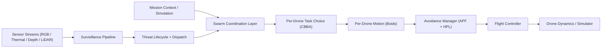
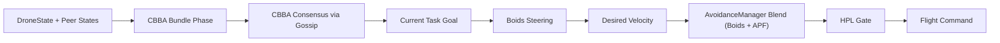

# Project Sanjay MK2

> **Authors**: Archishman Paul, Aniket More, Prathamesh Hiwarkar

A modular autonomous drone-swarm platform for surveillance, anomaly detection, and decentralized multi-agent coordination. Combines single-drone autonomy, swarm-level coordination (formation, CBBA tasking, Boids flocking), surveillance intelligence (sensor fusion, change detection, threat lifecycle), and simulation/integration paths (MuJoCo, Isaac Sim, ROS 2).

---

## Table of Contents

- [System Overview](#1-system-overview)
- [Architecture](#2-architecture)
- [Tech Stack](#3-tech-stack)
- [Project Structure](#4-project-structure)
- [Configuration](#5-configuration)
- [Environment Setup](#6-environment-setup)
- [Running the Project](#7-running-the-project)
- [Documentation](#8-documentation)
- [Validation & Testing](#9-validation--testing)
- [Troubleshooting](#10-troubleshooting)
- [Credits](#11-credits)

---

## 1. System Overview

### Mission Styles

Project Sanjay MK2 supports two major mission styles:

1. **Surveillance intelligence missions**
   - **Alpha drones** (6× at 65m altitude) cover area and detect anomalies using RGB, thermal, depth, and 3D LiDAR.
   - **Beta drones** (1× at 25m altitude) can be dispatched for high-confidence visual confirmation of detected threats.

2. **Decentralized swarm missions**
   - Each Alpha drone locally decides **what to do** via **CBBA** (Consensus-Based Bundle Algorithm).
   - Each Alpha drone locally decides **how to move** via **Boids** flocking + **APF/HPL** safety.
   - Swarm consensus is reached through gossip payload exchange over an in-process broadcast bus (or mesh network).

### Two-Tier Drone Model

| Tier | Role | Altitude | Sensors |
|------|------|----------|---------|
| **Alpha** | Patrol, anomaly detection, area coverage | 65m | RGB (84° FOV), Thermal, Depth, 3D RTX LiDAR, IMU |
| **Beta** | Interceptor, threat confirmation | 25m | RGB (50° FOV), Depth, IMU |

---

## 2. Architecture

### High-Level Data Flow



### Decentralized Swarm Control Loop



### Threat-Detection Pipeline


### Mission Runner Flow

```mermaid
flowchart LR
    A["Initialize 6 Drones"] --> B["Init AvoidanceManagers"]
    B --> C["Init 6 AlphaRegimentCoordinators"]
    C --> D["Tick Loop"]
    D --> E["Feed LiDAR"]
    E --> F["State Update + Gossip Exchange"]
    F --> G["Per-Coordinator coordination_step"]
    G --> H["Per-Drone Desired Velocity"]
    H --> I["Avoidance Blend + Safety Gate"]
    I --> J["Physics Step"]
    J --> K["Mission Metrics / Log Output"]
```



### Design Principles

- **Modular boundaries**: autonomy, swarm, surveillance, integration, and simulation are separated into distinct packages.
- **Type-driven interfaces**: `Vector3`, `DroneState`, `FlightMode`, `Threat`, `SensorObservation`, `FusedObservation` dataclasses are shared across layers.
- **Decentralization-first swarm mode**: Boids + CBBA run per-drone with gossip convergence; no central coordinator required.
- **Safety override hierarchy**: Boids/APF produce desired motion; HPL (Hardware Protection Layer) has final authority.
- **Simulation parity**: the same autonomy stack runs in headless scripts (synthetic LiDAR) and bridge-driven Isaac Sim mode.
- **Coordinate system**: NED (North-East-Down) — altitude is negative Z.

---

## 3. Tech Stack

### Core Dependencies

| Category | Libraries | Purpose |
|----------|------------|---------|
| **Numerical** | numpy, scipy | Scientific computing, geometry |
| **Config** | PyYAML | Configuration parsing |
| **Flight** | mavsdk, pymavlink, grpcio, protobuf | PX4/MAVLink communication |
| **Simulation** | mujoco, gymnasium | Physics simulation |
| **Rendering** | glfw, PyOpenGL | MuJoCo visualization |
| **ML/CV** | torch, torchvision, ultralytics | Object detection, inference |
| **Model export** | onnx, onnxruntime | Model export and runtime |
| **Vision** | opencv-python, pillow | Image processing |
| **Async/Net** | websockets, aiohttp, requests | Real-time streaming, HTTP |
| **Testing** | pytest, pytest-asyncio | Unit and integration tests |
| **Dev** | black, isort, flake8, mypy | Formatting, linting, type checking |

### Integration & Simulation

| Component | Tech | Role |
|-----------|------|------|
| **Isaac Sim** | NVIDIA Omniverse, USD | Photorealistic 3D simulation, RTX LiDAR |
| **ROS 2** | Humble, Fast DDS | Topic bridge between Isaac Sim and autonomy stack |
| **Docker** | osrf/ros:humble-desktop | ROS 2 environment on WSL2 |
| **MuJoCo** | mujoco 3.x | Lightweight physics for headless testing |
| **WebSocket** | websockets, aiohttp | Real-time visualization frontend |

### Target Platforms

- **Windows 10/11** — primary development (PowerShell, Isaac Sim)
- **WSL2 (Ubuntu 22.04)** — Docker, ROS 2 Humble
- **macOS** — supported via `setup_dev_env.sh` / `setup_macos.sh` (pyenv, venv)
- **Linux** — supported for headless and Docker workflows

---

## 4. Project Structure

```
Sanjay_MK2/
├── config/                    # YAML configuration
│   └── isaac_sim.yaml         # Drone topics, fusion, avoidance, regiment params
├── docker/                    # Container definitions
│   └── Dockerfile.autonomy    # ROS 2 Humble + Python deps for bridge/autonomy
├── docs/                      # Documentation
│   ├── ARCHITECTURE.md        # System design details
│   ├── API_REFERENCE.md
│   ├── ISAAC_SIM_SETUP.md    # Isaac Sim installation and ROS 2 bridge
│   ├── INSTALLATION_SUMMARY.md
│   └── SIMULATION_RUN_GUIDE.md
├── drone_visualization_live.html  # Web frontend for simulation server
├── examples/
│   └── week1_demo.py          # Basic flight control demo
├── network/
│   └── fastdds_profiles.xml   # Fast DDS loopback config (WSL2 ↔ Windows)
├── scripts/
│   ├── setup_dev_env.sh       # macOS/Linux venv setup
│   ├── setup_dev_env.ps1      # Windows venv setup
│   ├── setup_isaac_env.ps1    # Isaac Sim ROS 2 env vars
│   ├── setup_wsl2_env.sh      # WSL2 ROS 2 env
│   ├── simulation_server.py   # WebSocket + HTTP server for live visualization
│   └── isaac_sim/
│       ├── create_surveillance_scene.py   # USD scene builder
│       ├── launch_bridge.py               # Bridge launcher
│       ├── run_mission.py                 # Mission runner (headless/Isaac)
│       ├── waypoint_cli.py                # CLI for waypoints
│       └── waypoint_gui.py                # GUI panel (runs in Isaac Sim)
├── simulation/
│   ├── worlds/                # USD worlds (e.g. surveillance_arena.usd)
│   └── logs/                  # Mission JSON logs
├── src/
│   ├── core/                  # Base types, config, utilities
│   │   ├── types/
│   │   │   └── drone_types.py # Vector3, DroneState, FlightMode, Threat, etc.
│   │   ├── config/
│   │   │   └── config_manager.py
│   │   └── utils/
│   │       └── geometry.py    # Hex positions, etc.
│   ├── single_drone/          # Per-drone control stack
│   │   ├── flight_control/
│   │   │   ├── flight_controller.py
│   │   │   ├── waypoint_controller.py
│   │   │   ├── mavsdk_interface.py
│   │   │   ├── isaac_sim_interface.py
│   │   │   ├── manual_controller.py
│   │   │   └── mode_manager.py
│   │   ├── obstacle_avoidance/
│   │   │   ├── avoidance_manager.py   # APF + Tactical A* + HPL
│   │   │   ├── apf_3d.py
│   │   │   ├── tactical_planner.py
│   │   │   └── hardware_protection.py
│   │   └── sensors/
│   │       ├── rgb_camera.py
│   │       ├── thermal_camera.py
│   │       ├── depth_estimator.py
│   │       └── lidar_3d.py
│   ├── swarm/                 # Multi-drone coordination
│   │   ├── coordination/
│   │   │   └── regiment_coordinator.py  # AlphaRegimentCoordinator
│   │   ├── flock_coordinator.py
│   │   ├── boids/
│   │   │   ├── boids_engine.py
│   │   │   ├── boids_config.py
│   │   │   └── dynamic_behaviors.py
│   │   ├── cbba/
│   │   │   ├── cbba_engine.py
│   │   │   ├── task_types.py
│   │   │   └── task_generator.py
│   │   ├── formation/
│   │   │   └── formation_controller.py
│   │   └── fault_injection.py
│   ├── surveillance/          # World model, fusion, detection
│   │   ├── world_model.py
│   │   ├── sensor_fusion.py
│   │   ├── baseline_map.py
│   │   ├── change_detection.py
│   │   ├── threat_manager.py
│   │   └── coverage/
│   ├── integration/           # Isaac Sim bridge, coordinator
│   │   ├── isaac_sim_bridge.py
│   │   └── coordinator/
│   ├── communication/         # Mesh network (scaffolded)
│   │   ├── mesh_network/
│   │   └── state_sync/
│   └── simulation/            # MuJoCo runtime
│       └── mujoco_sim.py
├── tests/                     # Test suite
├── training_env/              # ML training environments
├── docker-compose.yml         # ROS 2 stack, isaac-bridge, swarm-controller
├── docker-compose.dev.yml     # Dev overrides
├── requirements.txt
└── README.md
```

### Key Modules

| Module | Role |
|--------|------|
| `src/core/types/drone_types.py` | `Vector3`, `DroneState`, `FlightMode`, `DroneType`, `SensorObservation`, `FusedObservation`, `Threat` |
| `src/single_drone/flight_control/flight_controller.py` | Async flight state machine, command orchestration |
| `src/single_drone/obstacle_avoidance/avoidance_manager.py` | APF + tactical planner + HPL integration |
| `src/swarm/coordination/regiment_coordinator.py` | `AlphaRegimentCoordinator` — Boids + CBBA + gossip, health/leader/load loops |
| `src/swarm/flock_coordinator.py` | Decentralized orchestrator combining CBBA and Boids |
| `src/integration/isaac_sim_bridge.py` | ROS 2 subscription/publish adapter into project types |
| `scripts/isaac_sim/run_mission.py` | Headless or Isaac Sim mission runner (6 drones) |
| `scripts/simulation_server.py` | WebSocket server + 3-drone hexagonal visualization |

---

## 5. Configuration

### Config Files

| File | Purpose |
|------|---------|
| `config/isaac_sim.yaml` | Drone topic mappings, fusion params, APF/HPL params, regiment config, scene, ROS 2 domain |

### Notable Config Surfaces

- **`src/core/config/config_manager.py`** — system-wide config singleton
- **`src/swarm/coordination/regiment_coordinator.py::RegimentConfig`** — `formation_spacing`, `formation_altitude`, `use_boids_flocking`, etc.
- **`config/isaac_sim.yaml`** — `drones`, `fusion`, `obstacle_avoidance`, `regiment`, `scene`, `ros2`

---

## 6. Environment Setup

### Prerequisites

| Requirement | Details |
|-------------|---------|
| **Python** | 3.11 (required for Isaac Sim compatibility) |
| **GPU** (Isaac Sim) | NVIDIA RTX 2070+ (ray tracing) |
| **OS** | Windows 10/11 with WSL2, or macOS/Linux |
| **Docker** (Isaac Sim) | Docker Desktop with WSL2 integration |

### One-Time Setup

**Windows (PowerShell):**

```powershell
cd D:\Sanjay_MK2
.\scripts\setup_dev_env.ps1
.\.venv\Scripts\Activate.ps1
```

**macOS / Linux:**

```bash
./scripts/setup_dev_env.sh
source .venv/bin/activate
```

This creates `.venv` with Python 3.11 and installs all dependencies from `requirements.txt`.

### Isaac Sim (optional)

For full Isaac Sim + ROS 2 workflows:

```powershell
# In project venv
pip install isaacsim[all] --extra-index-url https://pypi.nvidia.com
```

See `docs/ISAAC_SIM_SETUP.md` for ROS 2 bridge enablement and `docs/SIMULATION_RUN_GUIDE.md` for end-to-end run steps.

### WSL2 + Docker (Isaac Sim bridge)

For ROS 2 bridge and autonomy containers:

```bash
cd /mnt/d/Sanjay_MK2
./scripts/setup_wsl2_env.sh   # Optional: native ROS 2 in WSL2
docker compose --profile isaac up -d
```

Ensure `FASTRTPS_DEFAULT_PROFILES_FILE` points to `network/fastdds_profiles.xml` and `ROS_DOMAIN_ID=10` matches Isaac Sim.

---

## 7. Running the Project

### Run Tests

```bash
# With venv activated
python -m pytest tests/ -v
```

### Headless Mission (no Isaac Sim)

Synthetic LiDAR from procedural obstacles — no GUI, no Isaac Sim:

```bash
python scripts/isaac_sim/run_mission.py --headless --timeout 120
```

### Mission with Isaac Sim

1. Start Isaac Sim with ROS 2 bridge enabled (`.\scripts\setup_isaac_env.ps1` then `isaacsim`).
2. Load and run `scripts/isaac_sim/create_surveillance_scene.py` in the Script Editor, then Play.
3. In WSL2: `docker compose --profile isaac up -d`
4. Run mission:

```bash
python scripts/isaac_sim/run_mission.py --isaac --timeout 300
```

### WebSocket Simulation Server

3-drone hexagonal coverage with fault injection and live visualization:

```bash
python scripts/simulation_server.py
```

Then open http://localhost:8080 in a browser.

### Waypoint GUI / CLI

- **GUI** (inside Isaac Sim Script Editor): `scripts/isaac_sim/waypoint_gui.py`
- **CLI**: `python scripts/isaac_sim/waypoint_cli.py` — commands: `add 100 200 65`, `list`, `start`, `pause`, `resume`, `stop`

### Docker Compose Profiles

| Profile | Services |
|---------|----------|
| `autonomy` | autonomy-1 (listener), autonomy-2 (talker) |
| `isaac` | isaac-bridge (sensor fusion → change detection → threat manager) |
| `swarm` | swarm-controller (headless decentralized mission) |
| `mission` | mission-runner (live Isaac Sim mission) |
| `visualization` | rviz |
| `dev` | dev-tools, dev overrides for autonomy containers |

---

## 8. Documentation

| Document | Description |
|----------|-------------|
| `docs/ARCHITECTURE.md` | Two-tier model, sensor fusion, flight control, fault tolerance |
| `docs/ISAAC_SIM_SETUP.md` | Isaac Sim install, ROS 2 bridge, scene creation, bridge launch |
| `docs/SIMULATION_RUN_GUIDE.md` | Full run guide with terminals A/B/C, verification, troubleshooting |
| `docs/API_REFERENCE.md` | API documentation |
| `docs/INSTALLATION_SUMMARY.md` | Installed packages, week-by-week plan, simulation options |

---

## 9. Validation & Testing

- **Static checks**: Python 3.11 compatibility; filter out macOS AppleDouble files (`._*`, `.__*`) for `compileall`.
- **Unit/integration tests**: `tests/` for config, flight control, swarm, surveillance, bridge, CBBA, Boids.
- **Mission runtime smoke**: headless `run_mission.py` for end-to-end control loop.
- **Telemetry/logs**: mission logs in `simulation/logs/` (JSON with result, duration, collisions, HPL overrides, etc.).

---

## 10. Troubleshooting

| Issue | Fix |
|-------|-----|
| `ros2 topic list` empty | Ensure Isaac Sim ROS 2 bridge is enabled and scene is playing |
| Topics visible but no data | Check `ROS_DOMAIN_ID=10` on Isaac Sim and in Docker |
| Bridge can't find `rclpy` | Run inside Docker: `docker compose --profile isaac up` |
| Fast DDS discovery fails | Verify `fastdds_profiles.xml` is mounted and WSL2 networking is mirrored |
| `setup_dev_env` path errors | Edit script if project is not at expected path (e.g. `D:\Sanjay_MK2`) |
| ImportError on AppleDouble files | Exclude `._*`, `.__*` from source-only checks |

---

## 11. Credits

- **Archishman Paul** — algorithms, autonomy, simulation, infrastructure
- **Aniket More** — visualization, communication modules, testing
- **Prathamesh Hiwarkar** — data models, integration, documentation

---

## Current Status Snapshot

- Python 3.11 dev environment bootstrap works via `scripts/setup_dev_env.sh` (macOS/Linux) and `scripts/setup_dev_env.ps1` (Windows).
- Decentralized Boids + CBBA path is integrated and covered by tests.
- Full Isaac Sim workflow: scene creation → ROS 2 bridge → mission runner with 6 Alpha drones.
- WebSocket simulation server with 3-drone hexagonal coverage, fault injection, and task redistribution.
- Docker Compose profiles for ROS 2 stack, Isaac bridge, swarm controller, and mission runner.
