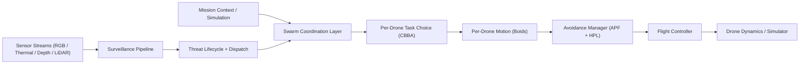
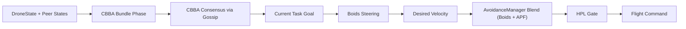
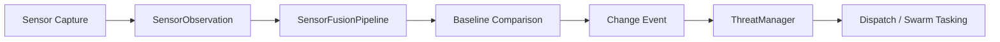

# Project Sanjay MK2

> **Authors**: Archishman Paul, Aniket More, Prathamesh Hiwarkar

A modular autonomous drone-swarm platform for surveillance, anomaly detection, and decentralized multi-agent coordination. Combines single-drone autonomy, swarm-level coordination (formation, CBBA tasking, Boids flocking), surveillance intelligence (sensor fusion, change detection, threat lifecycle), and simulation/integration paths (MuJoCo, Isaac Sim, ROS 2).

---

## Table of Contents

- [System Overview](#1-system-overview)
- [Architecture](#2-architecture)
- [Tech Stack](#3-tech-stack)
- [Project Structure](#4-project-structure)
- [One-Time Environment Setup (Windows + Isaac Sim)](#5-one-time-environment-setup-windows--isaac-sim)
- [Running Simulation Scenarios](#6-running-simulation-scenarios)
  - [Mode A — Headless (No Isaac Sim Required)](#mode-a--headless-no-isaac-sim-required)
  - [Mode B — Full Isaac Sim (RTX Rendering + Physics LiDAR)](#mode-b--full-isaac-sim-rtx-rendering--physics-lidar)
  - [Mode C — WebSocket Live Visualization](#mode-c--websocket-live-visualization)
- [Scenario Test Guide](#7-scenario-test-guide)
  - [Swarm Autonomy (CBBA + Boids)](#scenario-1-swarm-autonomy-cbba--boids)
  - [Obstacle Avoidance (APF + HPL)](#scenario-2-obstacle-avoidance-apf--hpl)
  - [Goal Achievement (Waypoint Mission)](#scenario-3-goal-achievement-waypoint-mission)
  - [Fault Injection & Recovery](#scenario-4-fault-injection--recovery)
  - [Unit Test Suite](#scenario-5-unit-test-suite)
- [Reading Mission Logs](#8-reading-mission-logs)
- [Configuration Reference](#9-configuration-reference)
- [Troubleshooting](#10-troubleshooting)
- [Credits](#11-credits)

---

## 1. System Overview

### Mission Styles

Project Sanjay MK2 supports two major mission styles:

1. **Surveillance intelligence missions**
   - **Alpha drones** (6× at 65m altitude) cover area and detect anomalies using RGB, thermal, depth, and 3D LiDAR.
   - **Beta drones** (1× at 25m altitude) can be dispatched for high-confidence visual confirmation of detected threats.

2. **Decentralized swarm missions**
   - Each Alpha drone locally decides **what to do** via **CBBA** (Consensus-Based Bundle Algorithm).
   - Each Alpha drone locally decides **how to move** via **Boids** flocking + **APF/HPL** safety.
   - Swarm consensus is reached through gossip payload exchange over an in-process broadcast bus (or mesh network).

### Two-Tier Drone Model

| Tier | Role | Altitude | Sensors |
|------|------|----------|---------|
| **Alpha** | Patrol, anomaly detection, area coverage | 65m | RGB (84° FOV), Thermal, Depth, 3D RTX LiDAR, IMU |
| **Beta** | Interceptor, threat confirmation | 25m | RGB (50° FOV), Depth, IMU |

---

## 2. Architecture

### High-Level Data Flow



### Decentralized Swarm Control Loop



### Threat-Detection Pipeline



### Mission Runner Flow

```mermaid
flowchart LR
    A["Initialize 6 Drones"] --> B["Init AvoidanceManagers"]
    B --> C["Init 6 AlphaRegimentCoordinators"]
    C --> D["Tick Loop"]
    D --> E["Feed LiDAR"]
    E --> F["State Update + Gossip Exchange"]
    F --> G["Per-Coordinator coordination_step"]
    G --> H["Per-Drone Desired Velocity"]
    H --> I["Avoidance Blend + Safety Gate"]
    I --> J["Physics Step"]
    J --> K["Mission Metrics / Log Output"]
```



### Design Principles

- **Modular boundaries**: autonomy, swarm, surveillance, integration, and simulation are separated into distinct packages.
- **Type-driven interfaces**: `Vector3`, `DroneState`, `FlightMode`, `Threat`, `SensorObservation`, `FusedObservation` dataclasses are shared across layers.
- **Decentralization-first swarm mode**: Boids + CBBA run per-drone with gossip convergence; no central coordinator required.
- **Safety override hierarchy**: Boids/APF produce desired motion; HPL (Hardware Protection Layer) has final authority.
- **Simulation parity**: the same autonomy stack runs in headless scripts (synthetic LiDAR) and bridge-driven Isaac Sim mode.
- **Coordinate system**: NED (North-East-Down) — altitude is negative Z.

---

## 3. Tech Stack

### Core Dependencies

| Category | Libraries | Purpose |
|----------|------------|---------|
| **Numerical** | numpy, scipy | Scientific computing, geometry |
| **Config** | PyYAML | Configuration parsing |
| **Flight** | mavsdk, pymavlink, grpcio, protobuf | PX4/MAVLink communication (optional for Isaac Sim) |
| **Simulation** | mujoco, gymnasium | Physics simulation |
| **Rendering** | glfw, PyOpenGL | MuJoCo visualization |
| **ML/CV** | torch, torchvision, ultralytics | Object detection, inference |
| **Model export** | onnx, onnxruntime | Model export and runtime |
| **Vision** | opencv-python, pillow | Image processing |
| **Async/Net** | websockets, aiohttp, requests | Real-time streaming, HTTP |
| **Testing** | pytest, pytest-asyncio | Unit and integration tests |
| **Dev** | black, isort, flake8, mypy | Formatting, linting, type checking |

### Integration & Simulation

| Component | Tech | Role |
|-----------|------|------|
| **Isaac Sim** | NVIDIA Omniverse, USD | Photorealistic 3D simulation, RTX LiDAR |
| **ROS 2** | Humble, Fast DDS | Topic bridge between Isaac Sim and autonomy stack |
| **Docker** | osrf/ros:humble-desktop | ROS 2 environment on WSL2 |
| **MuJoCo** | mujoco 3.x | Lightweight physics for headless testing |
| **WebSocket** | websockets, aiohttp | Real-time visualization frontend |

### Target Platforms

- **Windows 10/11** — primary development (PowerShell, Isaac Sim)
- **WSL2 (Ubuntu 22.04)** — Docker, ROS 2 Humble
- **macOS** — supported via `setup_dev_env.sh` / `setup_macos.sh` (pyenv, venv)
- **Linux** — supported for headless and Docker workflows

---

## 4. Project Structure

```
Sanjay_MK2/
├── config/                    # YAML configuration
│   └── isaac_sim.yaml         # Drone topics, fusion, avoidance, regiment params
├── docker/                    # Container definitions
│   └── Dockerfile.autonomy    # ROS 2 Humble + Python deps for bridge/autonomy
├── docs/                      # Documentation
│   ├── ARCHITECTURE.md        # System design details
│   ├── API_REFERENCE.md
│   ├── ISAAC_SIM_SETUP.md    # Isaac Sim installation and ROS 2 bridge
│   ├── INSTALLATION_SUMMARY.md
│   └── SIMULATION_RUN_GUIDE.md
├── drone_visualization_live.html  # Web frontend for simulation server
├── examples/
│   └── week1_demo.py          # Basic flight control demo
├── network/
│   └── fastdds_profiles.xml   # Fast DDS loopback config (WSL2 ↔ Windows)
├── scripts/
│   ├── setup_dev_env.sh       # macOS/Linux venv setup
│   ├── setup_dev_env.ps1      # Windows venv setup
│   ├── setup_isaac_env.ps1    # Isaac Sim ROS 2 env vars
│   ├── setup_wsl2_env.sh      # WSL2 ROS 2 env
│   ├── simulation_server.py   # WebSocket + HTTP server for live visualization
│   └── isaac_sim/
│       ├── create_surveillance_scene.py   # USD scene builder
│       ├── launch_bridge.py               # Bridge launcher
│       ├── run_mission.py                 # Mission runner (headless/Isaac)
│       ├── waypoint_cli.py                # CLI for waypoints
│       └── waypoint_gui.py                # GUI panel (runs in Isaac Sim)
├── simulation/
│   ├── worlds/                # USD worlds (e.g. surveillance_arena.usd)
│   └── logs/                  # Mission JSON logs
├── src/
│   ├── core/                  # Base types, config, utilities
│   │   ├── types/
│   │   │   └── drone_types.py # Vector3, DroneState, FlightMode, Threat, etc.
│   │   ├── config/
│   │   │   └── config_manager.py
│   │   └── utils/
│   │       └── geometry.py    # Hex positions, etc.
│   ├── single_drone/          # Per-drone control stack
│   │   ├── flight_control/
│   │   │   ├── flight_controller.py
│   │   │   ├── waypoint_controller.py
│   │   │   ├── mavsdk_interface.py
│   │   │   ├── isaac_sim_interface.py
│   │   │   ├── manual_controller.py
│   │   │   └── mode_manager.py
│   │   ├── obstacle_avoidance/
│   │   │   ├── avoidance_manager.py   # APF + Tactical A* + HPL
│   │   │   ├── apf_3d.py
│   │   │   ├── tactical_planner.py
│   │   │   └── hardware_protection.py
│   │   └── sensors/
│   │       ├── rgb_camera.py
│   │       ├── thermal_camera.py
│   │       ├── depth_estimator.py
│   │       └── lidar_3d.py
│   ├── swarm/                 # Multi-drone coordination
│   │   ├── coordination/
│   │   │   └── regiment_coordinator.py  # AlphaRegimentCoordinator
│   │   ├── flock_coordinator.py
│   │   ├── boids/
│   │   │   ├── boids_engine.py
│   │   │   ├── boids_config.py
│   │   │   └── dynamic_behaviors.py
│   │   ├── cbba/
│   │   │   ├── cbba_engine.py
│   │   │   ├── task_types.py
│   │   │   └── task_generator.py
│   │   ├── formation/
│   │   │   └── formation_controller.py
│   │   └── fault_injection.py
│   ├── surveillance/          # World model, fusion, detection
│   │   ├── world_model.py
│   │   ├── sensor_fusion.py
│   │   ├── baseline_map.py
│   │   ├── change_detection.py
│   │   ├── threat_manager.py
│   │   └── coverage/
│   ├── integration/           # Isaac Sim bridge, coordinator
│   │   ├── isaac_sim_bridge.py
│   │   └── coordinator/
│   ├── communication/         # Mesh network (scaffolded)
│   │   ├── mesh_network/
│   │   └── state_sync/
│   └── simulation/            # MuJoCo runtime
│       └── mujoco_sim.py
├── tests/                     # Test suite
├── training_env/              # ML training environments
├── docker-compose.yml         # ROS 2 stack, isaac-bridge, swarm-controller
├── docker-compose.dev.yml     # Dev overrides
├── requirements.txt
└── README.md
```

### Key Modules

| Module | Role |
|--------|------|
| `src/core/types/drone_types.py` | `Vector3`, `DroneState`, `FlightMode`, `DroneType`, `SensorObservation`, `FusedObservation`, `Threat` |
| `src/single_drone/flight_control/flight_controller.py` | Async flight state machine, command orchestration |
| `src/single_drone/obstacle_avoidance/avoidance_manager.py` | APF + tactical planner + HPL integration |
| `src/swarm/coordination/regiment_coordinator.py` | `AlphaRegimentCoordinator` — Boids + CBBA + gossip, health/leader/load loops |
| `src/swarm/flock_coordinator.py` | Decentralized orchestrator combining CBBA and Boids |
| `src/integration/isaac_sim_bridge.py` | ROS 2 subscription/publish adapter into project types |
| `scripts/isaac_sim/run_mission.py` | Headless or Isaac Sim mission runner (6 drones) |
| `scripts/simulation_server.py` | WebSocket server + 3-drone hexagonal visualization |

---

## 5. One-Time Environment Setup (Windows + Isaac Sim)

> These steps are done once. After this, skip directly to [Section 6](#6-running-simulation-scenarios).

### Prerequisites

| Requirement | Minimum | Notes |
|-------------|---------|-------|
| Windows 10/11 | 64-bit | PowerShell 5.1+ |
| Python 3.11 | 3.11.x | **Do not use 3.12+** — Isaac Sim requires 3.11 |
| NVIDIA GPU | RTX 4060 | Driver 525+ required for Isaac Sim |
| NVIDIA Driver | 525.60+ | Check: `nvidia-smi` in PowerShell |
| Git | Any | To clone the repo |
| WSL2 (optional) | Ubuntu 22.04 | Only needed for ROS 2 bridge path |

---

### Step 1 — Clone the Repository

Open **PowerShell as Administrator**:

```powershell
cd D:\
git clone <repo-url> Sanjay_MK2
cd D:\Sanjay_MK2
```

> If the repo is already cloned, just `cd D:\Sanjay_MK2`.

---

### Step 2 — Run the Automated Python + venv Setup

```powershell
cd D:\Sanjay_MK2
.\scripts\setup_dev_env.ps1
```

This script will:
- Find (or offer to install) Python 3.11
- Create `.venv` inside the project root
- Install all dependencies from `requirements.txt`
- Verify the installation

Expected output at the end:
```
========================================
  Setup complete!
========================================
  Activate the environment:
    .\.venv\Scripts\Activate.ps1
```

If you see an error about script execution policy, run this first:
```powershell
Set-ExecutionPolicy -ExecutionPolicy RemoteSigned -Scope CurrentUser
```

---

### Step 3 — Activate the Virtual Environment

```powershell
.\.venv\Scripts\Activate.ps1
```

Your prompt should now show `(.venv)`. **Do this every time you open a new PowerShell window.**

---

### Step 4 — Install Isaac Sim (Required for Mode B)

> Skip this step if you only intend to run headless simulations (Mode A).

```powershell
# With .venv activated
pip install isaacsim[all] --extra-index-url https://pypi.nvidia.com
```

This downloads ~15 GB. It installs Isaac Sim as a Python package with all extensions including the bundled ROS 2 Humble bridge.

Verify the install completed:
```powershell
python -c "import isaacsim; print('Isaac Sim OK')"
```

---

### Step 5 — Verify the Full Setup

With `.venv` activated, run:

```powershell
python -m pytest tests/test_config_manager.py tests/test_drone_types.py tests/test_avoidance_stack.py -v
```

All tests should pass. If they do, the environment is ready.

---

## 6. Running Simulation Scenarios

There are three modes. Start with **Mode A** to verify everything works before moving to Isaac Sim.

---

### Mode A — Headless (No Isaac Sim Required)

This mode uses a synthetic LiDAR model against the pre-built obstacle database (downtown + industrial + residential zones). No GPU, no Isaac Sim window. Fastest way to iterate.

#### Start a headless mission

Open PowerShell, activate venv, then:

```powershell
cd D:\Sanjay_MK2
.\.venv\Scripts\Activate.ps1
python scripts\isaac_sim\run_mission.py --headless
```

Default timeout is 600 seconds (10 min). To shorten for quick tests:

```powershell
python scripts\isaac_sim\run_mission.py --headless --timeout 60
```

#### What you will see in the console

```
09:12:01 [INFO    ] MissionRunner              ================================================================
09:12:01 [INFO    ] MissionRunner                PROJECT SANJAY MK2 — Mission Runner
09:12:01 [INFO    ] MissionRunner                Mode: Headless
09:12:01 [INFO    ] MissionRunner                Drones: 6
09:12:01 [INFO    ] MissionRunner                Obstacles: 56
09:12:01 [INFO    ] MissionRunner                Mission: Full 6-drone decentralized autonomy
09:12:01 [INFO    ] MissionRunner              ================================================================
```

Every 10 ticks you will see per-drone avoidance state lines:
```
09:12:03 [INFO    ] MissionRunner    alpha_0 | pos=(200.0, 200.0, -65.0) vel=(0.0, 0.0, 0.0) state=CLEAR
09:12:03 [INFO    ] MissionRunner    alpha_1 | pos=(280.0, 200.0, -65.0) vel=(1.2, 0.3, 0.0) state=MONITORING
```

On completion a JSON log is saved to `simulation/logs/`.

---

### Mode B — Full Isaac Sim (RTX Rendering + Physics LiDAR)

This mode uses Isaac Sim's physics engine for LiDAR, RTX rendering, and the ROS 2 bridge to pipe real sensor data into the autonomy stack.

> **Requirements for Mode B**: Isaac Sim installed (Step 4), and optionally WSL2 + Docker for the ROS 2 bridge path.

#### Terminal 1 — Set up ROS 2 environment variables and launch Isaac Sim

Open **a fresh PowerShell** (do not reuse the one with `.venv` activated):

```powershell
cd D:\Sanjay_MK2
.\scripts\setup_isaac_env.ps1
isaacsim --enable isaacsim.ros2.bridge
```

`setup_isaac_env.ps1` sets `ROS_DOMAIN_ID=10`, `RMW_IMPLEMENTATION=rmw_fastrtps_cpp`, and adds the bundled ROS 2 Humble DLLs to PATH. Isaac Sim will take 2-4 minutes to fully load on first run.

Wait until you see the Isaac Sim main window with the viewport open.

#### Terminal 2 — Build the surveillance scene inside Isaac Sim

Once Isaac Sim is open:

1. In Isaac Sim, go to: **Window → Script Editor**
2. In the Script Editor, click **Open** and navigate to:
   ```
   D:\Sanjay_MK2\scripts\isaac_sim\create_surveillance_scene.py
   ```
3. Click **Run** (the play button in the Script Editor toolbar)

This builds the full 1000×1000m urban scene (downtown towers, industrial compound, residential blocks, forest canopy, antenna corridors) with 6 Alpha drones in hexagonal formation and 1 Beta drone. The scene is saved to `simulation/worlds/surveillance_arena.usd`.

4. In Isaac Sim's toolbar, click **Play** (the triangle button) to start the physics simulation.

#### Terminal 3 — Start the ROS 2 bridge (WSL2, optional)

> Only needed if you want live LiDAR/sensor data piped from Isaac Sim into the autonomy stack. Skip this if testing standalone mission logic.

Open **WSL2 Ubuntu terminal**:

```bash
cd /mnt/d/Sanjay_MK2
export FASTRTPS_DEFAULT_PROFILES_FILE=/mnt/d/Sanjay_MK2/network/fastdds_profiles.xml
export ROS_DOMAIN_ID=10
docker compose --profile isaac up -d
```

Verify topics are visible:
```bash
docker exec -it sanjay-isaac-bridge ros2 topic list
```

You should see topics like `/alpha_0/lidar/points`, `/alpha_0/odom`, `/alpha_0/cmd_vel` etc.

#### Terminal 4 — Run the Isaac Sim mission (with .venv activated)

```powershell
cd D:\Sanjay_MK2
.\.venv\Scripts\Activate.ps1
python scripts\isaac_sim\run_mission.py --isaac --timeout 300
```

The `--isaac` flag tells the runner to connect to the Isaac Sim overlay, register stage sync callbacks, and attempt ROS 2 bridge velocity publishing.

Alternatively, you can run the mission directly from Isaac Sim's Script Editor:

```python
exec(open('scripts/isaac_sim/run_mission.py').read())
```

(This uses the existing event loop automatically — no `asyncio.run()` needed.)

---

### Mode C — WebSocket Live Visualization

This runs a 3-drone hexagonal simulation with fault injection and streams telemetry to a browser frontend. Does not require Isaac Sim.

#### Step 1 — Start the simulation server

```powershell
cd D:\Sanjay_MK2
.\.venv\Scripts\Activate.ps1
python scripts\simulation_server.py
```

Expected output:
```
[INFO] SimulationServer: Starting simulation server...
[INFO] SimulationServer: WebSocket server on ws://localhost:8765
[INFO] SimulationServer: HTTP server on http://localhost:8080
[INFO] SimulationServer: Simulation started
```

#### Step 2 — Open the live visualization

Open a browser and navigate to:
```
http://localhost:8080
```

Or open the file directly:
```
D:\Sanjay_MK2\drone_visualization_live.html
```

The visualization shows 3 drones in hexagonal coverage, live telemetry panels, and battery/fault status.

---

## 7. Scenario Test Guide

All scenarios below assume the `.venv` is activated and you are in `D:\Sanjay_MK2`.

---

### Scenario 1: Swarm Autonomy (CBBA + Boids)

Tests decentralized task allocation (CBBA) and flocking motion (Boids) across all 6 drones.

**What it exercises**: `AlphaRegimentCoordinator`, `CBBAEngine`, `BoidsEngine`, gossip bus, leader election, sector assignment.

#### Run (headless):

```powershell
python scripts\isaac_sim\run_mission.py --headless --timeout 120
```

#### What to observe in the console:

Look for these log patterns to confirm swarm coordination is active:

```
# CBBA task allocation — each drone should show task assignments
[INFO] alpha_0.coordinator   CBBA bundle updated: ['PATROL_WP_01', 'SURVEY_ZONE_A']
[INFO] alpha_1.coordinator   CBBA bundle updated: ['PATROL_WP_04', 'COVER_SECTOR_2']

# Gossip convergence — peers exchanging state
[INFO] alpha_0.coordinator   Gossip received from alpha_1, alpha_2, alpha_3

# Leader election
[INFO] alpha_0.coordinator   Elected as regiment leader (score=0.87)

# Boids formation maintenance — drones maintaining spacing
[INFO] MissionRunner         Min inter-drone distance: 52.4m  (healthy: > 50m)
```

#### Pass criteria:
- Mission runs for the full timeout without `COLLISION` or `HPL_OVERRIDE` flood in logs
- `min_inter_drone_distance` in the final JSON log is > 50m
- `result` in the JSON log is `SUCCESS` or `TIMEOUT` (not `COLLISION`)

---

### Scenario 2: Obstacle Avoidance (APF + HPL)

Tests the Artificial Potential Field (APF) avoidance layer and Hardware Protection Layer (HPL) safety gate across the 3 dense obstacle zones (downtown buildings, industrial pipes/tanks, residential blocks).

**What it exercises**: `AvoidanceManager`, `APF3DAvoidance`, `HardwareProtectionLayer`, `TacticalPlanner`, `SyntheticLidar`.

#### Run unit tests for the avoidance stack first:

```powershell
python -m pytest tests\test_avoidance_stack.py -v
```

Expected output:
```
tests/test_avoidance_stack.py::TestAPF3DAvoidance::test_clear_state_when_no_obstacles PASSED
tests/test_avoidance_stack.py::TestAPF3DAvoidance::test_repulsion_near_obstacle PASSED
tests/test_avoidance_stack.py::TestHardwareProtectionLayer::test_passive_state_without_scan PASSED
tests/test_avoidance_stack.py::TestTacticalPlanner::test_plan_with_obstacles PASSED
tests/test_avoidance_stack.py::TestAvoidanceManager::test_feed_lidar_points PASSED
...
```

#### Run end-to-end avoidance scenario (headless, short timeout):

```powershell
python scripts\isaac_sim\run_mission.py --headless --timeout 90
```

#### What to observe in the console:

```
# Avoidance state transitions
[INFO] MissionRunner  alpha_2 | state=AVOIDING  (APF active, obstacle within 15m)
[INFO] MissionRunner  alpha_2 | state=CLEAR      (obstacle cleared)

# HPL override events (should be rare, not continuous)
[WARNING] MissionRunner  HPL override on alpha_3: hard stop triggered (dist=1.2m)

# Tactical planner A* replanning
[INFO] alpha_0.avoidance  Tactical replan: new path around obstacle at (215, 205)
```

#### Pass criteria:
- `collisions` in the final JSON log is `0`
- `hpl_overrides` is low (< 5 in a 90s run is healthy; continuous HPL overrides indicate drones are stuck)
- Drones successfully traverse the downtown zone (waypoints WP_01–WP_03) and industrial zone (WP_04–WP_06)

---

### Scenario 3: Goal Achievement (Waypoint Mission)

Tests that the 6-drone swarm navigates through the full 11-waypoint mission sequence autonomously.

**Waypoint sequence:**

| ID | Position (x, y, alt) | Label |
|----|----------------------|-------|
| WP_01 | (200, 200, 65m) | Downtown Entry |
| WP_02 | (250, 200, 65m) | Tower Gap |
| WP_03 | (280, 260, 65m) | U-Trap Test |
| WP_04 | (500, 160, 65m) | Industrial Entry |
| WP_05 | (530, 170, 65m) | Pipe Corridor |
| WP_06 | (550, 140, 65m) | Tank Slalom |
| WP_07 | (150, 600, 55m) | Forest Ingress |
| WP_08 | (200, 620, 50m) | Canopy Skim |
| WP_09 | (620, 400, 65m) | Pylon Slalom |
| WP_10 | (700, 400, 65m) | Antenna Weave |
| WP_11 | (400, 350, 65m) | RTB |

#### Run the waypoint controller path:

```powershell
python scripts\isaac_sim\run_mission.py --headless --controller-path --timeout 300
```

The `--controller-path` flag routes motion commands through `FlightController` + `WaypointController` instead of the raw avoidance velocity output.

#### Use the waypoint CLI to inject custom waypoints at runtime:

Open a second PowerShell (with `.venv` activated):

```powershell
python scripts\isaac_sim\waypoint_cli.py
```

CLI commands:
```
add 300 300 65     # Add waypoint at x=300, y=300, altitude=65m
add 450 450 65
list               # Show all queued waypoints
start              # Begin executing the waypoint sequence
pause              # Pause mid-mission
resume             # Resume from pause
stop               # Abort mission
```

#### What to observe:

```
[INFO] WaypointController  Navigating to WP_01: Downtown Entry (200, 200, 65m)
[INFO] WaypointController  WP_01 reached (acceptance radius 5m). Progress: 1/11
[INFO] WaypointController  Navigating to WP_02: Tower Gap (250, 200, 65m)
...
[INFO] WaypointController  All waypoints completed. Mission SUCCESS.
```

#### Pass criteria:
- `result: "SUCCESS"` in the final JSON log
- All 11 waypoints logged as reached in `events` list
- `collisions: 0`

---

### Scenario 4: Fault Injection & Recovery

Tests autonomous task redistribution when a drone is taken offline mid-mission.

**What it exercises**: `FaultInjector`, `TaskRedistributor`, `TestScenarioRunner`, CBBA re-convergence.

#### Run the fault injection test suite:

```powershell
python -m pytest tests\test_swarm_edge_cases.py -v
```

#### Run an interactive fault injection scenario via the WebSocket server:

```powershell
python scripts\simulation_server.py
```

Open `http://localhost:8080` in a browser. The visualization server has built-in fault injection — one of the 3 drones will simulate a battery failure, GPS spoof, or motor failure after a random interval. Watch the other drones redistribute coverage and tasks automatically.

#### Run the swarm edge case scenarios directly:

```powershell
python -m pytest tests\test_swarm_edge_cases.py tests\test_regiment_coordinator.py tests\test_flock_coordinator.py -v
```

#### What to observe:

```
# Drone failure detected
[INFO] swarm.fault   alpha_2: MOTOR_FAILURE injected (severity=CRITICAL)
[INFO] alpha_2.coordinator   Fault detected: entering DEGRADED mode

# Task redistribution
[INFO] alpha_0.coordinator   CBBA re-auction: picked up tasks from alpha_2
[INFO] alpha_1.coordinator   CBBA re-auction: picked up tasks from alpha_2

# Formation adjustment
[INFO] MissionRunner  Formation rebalanced: 5 active drones, spacing adjusted to 90m
```

---

### Scenario 5: Unit Test Suite

Run the complete test suite to validate all components:

#### Full suite:

```powershell
python -m pytest tests\ -v
```

#### Individual component tests:

```powershell
# Swarm coordination (CBBA + Boids + Formation)
python -m pytest tests\test_cbba_engine.py tests\test_boids_engine.py tests\test_formation_controller.py -v

# Obstacle avoidance stack
python -m pytest tests\test_avoidance_stack.py -v

# Regiment coordinator (leader election, gossip, C-SLAM)
python -m pytest tests\test_regiment_coordinator.py -v

# Surveillance pipeline (change detection, threat manager)
python -m pytest tests\test_change_detection.py tests\test_threat_manager.py -v

# Flight controller state machine
python -m pytest tests\test_flight_controller.py -v

# Flock coordinator integration
python -m pytest tests\test_flock_coordinator.py -v

# Task generator
python -m pytest tests\test_task_generator.py -v

# Config and types
python -m pytest tests\test_config_manager.py tests\test_drone_types.py -v
```

#### Expected pass rates:

All tests should pass. Any failure is a regression — check the error message and compare against the latest commit.

---

## 8. Reading Mission Logs

After each headless or Isaac Sim mission, a JSON log is saved to:

```
simulation\logs\mission_<timestamp>.json
```

#### Log structure:

```json
{
  "result": "SUCCESS",
  "duration_s": 87.4,
  "min_inter_drone_distance_m": 52.1,
  "hpl_overrides": 2,
  "collisions": 0,
  "drone_finals": {
    "alpha_0": {
      "position": [400.2, 350.1, -65.0],
      "battery": 78.3
    }
  },
  "events": [
    {"time": 0.0,  "drone": "SYSTEM",  "event": "Mission started"},
    {"time": 12.4, "drone": "alpha_0", "event": "CBBA bundle updated"},
    {"time": 45.1, "drone": "alpha_2", "event": "HPL override triggered"},
    ...
  ]
}
```

#### Interpreting results:

| Field | Healthy value | Warning |
|-------|--------------|---------|
| `result` | `"SUCCESS"` or `"TIMEOUT"` | `"COLLISION"` = crash |
| `collisions` | `0` | > 0 = avoidance failure |
| `hpl_overrides` | < 5 per 60s | High count = drones stuck |
| `min_inter_drone_distance_m` | > 50m | < 20m = collision risk |
| `duration_s` | < `timeout` | Equals timeout = mission incomplete |

---

## 9. Configuration Reference

The main configuration file is `config/isaac_sim.yaml`.

### Key parameters to tune for testing:

```yaml
# Formation spacing between Alpha drones (meters)
regiment:
  formation_spacing: 80.0      # Increase for sparser formation, decrease for tighter

# Obstacle avoidance aggressiveness
obstacle_avoidance:
  apf:
    detection_range: 15.0      # LiDAR detection radius (m)
    safe_distance: 6.0         # Minimum safe clearance (m)
    repulsive_gain: 8.0        # Higher = stronger avoidance push

# Gossip / heartbeat rate (lower = less CPU, higher = faster consensus)
# Configured in src/core/config/config_manager.py:
#   gossip_interval: 0.2       # 5 Hz
#   heartbeat_interval: 0.2    # 5 Hz

# Mission timeout (also settable via --timeout flag)
# Default: 600 seconds
```

### Switching between headless and Isaac Sim modes:

The `run_mission.py` script auto-detects based on `--headless` / `--isaac` flags. The `backend="isaac_sim"` flag in `FlightController` means MAVSDK is never required for Isaac Sim runs.

---

## 10. Troubleshooting

### Setup Issues

| Problem | Fix |
|---------|-----|
| `setup_dev_env.ps1` fails with "execution policy" error | Run `Set-ExecutionPolicy -ExecutionPolicy RemoteSigned -Scope CurrentUser` |
| Python 3.11 not found by setup script | Install from https://python.org/downloads/release/python-3119/ — check "Add to PATH" |
| `pip install isaacsim[all]` fails | Ensure NVIDIA driver ≥ 525 is installed (`nvidia-smi`) and `--extra-index-url https://pypi.nvidia.com` is included |
| `import isaacsim` succeeds but Isaac Sim window crashes | Update NVIDIA driver to latest Game Ready or Studio driver for RTX 4060 |

### Headless Mode Issues

| Problem | Fix |
|---------|-----|
| `ModuleNotFoundError: No module named 'src'` | Run from project root (`D:\Sanjay_MK2`), not from `scripts\` |
| Mission exits immediately with `COLLISION` | APF tuning issue — increase `detection_range` or `safe_distance` in `config/isaac_sim.yaml` |
| `ImportError: mavsdk is not installed` | You are not using `--headless` mode. Add `--headless` flag, or the code will try to use MAVSDK backend |
| Very slow simulation | Check Task Manager — numpy/torch may not be using GPU for headless; this is normal, headless is CPU-only |

### Isaac Sim Issues

| Problem | Fix |
|---------|-----|
| Isaac Sim hangs on startup | First launch always takes 3-5 min for shader compilation — wait for the viewport to fully appear |
| `setup_isaac_env.ps1` exits with "Bundled ROS 2 libs not found" | Isaac Sim not installed via pip — run `pip install isaacsim[all] --extra-index-url https://pypi.nvidia.com` |
| `create_surveillance_scene.py` throws `RuntimeError: This script must be run inside NVIDIA Isaac Sim` | Script must be run via the Isaac Sim Script Editor, not standalone PowerShell |
| `ros2 topic list` empty in WSL2 | Check `ROS_DOMAIN_ID=10` in both WSL2 and the Isaac Sim env script; check WSL2 network mode is "mirrored" |
| Topics visible but no data flowing | Confirm Isaac Sim simulation is in **Play** state (not Paused); check bridge container: `docker logs sanjay-isaac-bridge` |
| `No running loop` crash | This is fixed in the current `main` branch. Ensure you are on the latest local commit (`git log --oneline -1`) |

### Test Failures

| Problem | Fix |
|---------|-----|
| `test_flight_controller.py` fails with ImportError | Tests use `backend="isaac_sim"` — ensure you are on the latest commit where this is the default |
| `test_config_manager.py::test_default_config` fails with gossip_interval assertion | Default is now `0.2` (5 Hz). Ensure you are on the latest local commit, not the remote |
| Async test timeouts | Run with `python -m pytest tests\ -v --timeout=60` |

---

## 11. Credits

- **Archishman Paul** — algorithms, autonomy, simulation, infrastructure
- **Aniket More** — visualization, communication modules, testing
- **Prathamesh Hiwarkar** — data models, integration, documentation

---

## Current Status Snapshot

- Python 3.11 dev environment bootstrap works via `scripts/setup_dev_env.ps1` (Windows) and `scripts/setup_dev_env.sh` (macOS/Linux).
- Decentralized Boids + CBBA path is integrated and covered by tests.
- Full Isaac Sim workflow: scene creation → ROS 2 bridge → mission runner with 6 Alpha drones.
- WebSocket simulation server with 3-drone hexagonal coverage, fault injection, and task redistribution.
- Docker Compose profiles for ROS 2 stack, Isaac bridge, swarm controller, and mission runner.
- Asyncio event loop handling is stable across both standalone and Isaac Sim Script Editor launch paths.
