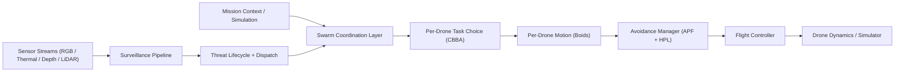
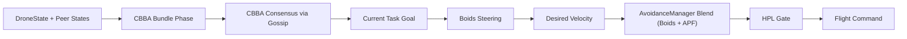
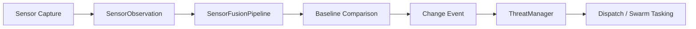

# Project Sanjay MK2
> **Authors**: Archishman Paul, Aniket More, Prathamesh Hiwarkar

Project Sanjay MK2 is a modular autonomous drone-swarm platform for surveillance, anomaly detection, and decentralized multi-agent coordination.

It combines:
- single-drone autonomy (flight + obstacle avoidance)
- swarm-level coordination (formation, CBBA tasking, Boids flocking)
- surveillance intelligence (sensor fusion, change detection, threat lifecycle)
- simulation and integration paths (MuJoCo and Isaac Sim bridge)

This README is a full technical orientation for engineers working directly in this codebase.

## 1. System Purpose
The platform supports two major mission styles:

1. **Surveillance intelligence missions**
- Alpha drones cover area and detect anomalies.
- Beta drones can be dispatched to confirm threats.

2. **Decentralized swarm missions**
- Each Alpha drone locally decides **what to do** via CBBA.
- Each Alpha drone locally decides **how to move** via Boids + APF/HPL safety.
- Swarm consensus is reached through gossip payload exchange.

## 2. High-Level Architecture


## 3. Core Design Principles
- **Modular boundaries**: autonomy, swarm, surveillance, integration, and simulation are separated.
- **Type-driven interfaces**: `Vector3`, `DroneState`, `FlightMode`, `Threat` dataclasses are shared across layers.
- **Decentralization-first swarm mode**: Boids + CBBA can run per drone with gossip convergence.
- **Safety override hierarchy**: Boids/APF produce desired motion; HPL has final authority.
- **Simulation parity**: same autonomy stack is testable in headless scripts and bridge-driven Isaac Sim mode.

## 4. Codebase Tour
### 4.1 Top-level folders
- `src/core`: base types, config, reusable utilities.
- `src/single_drone`: per-drone control stack.
- `src/swarm`: multi-drone coordination, formation, fault-injection, decentralized flocking.
- `src/surveillance`: world model + perception/change/threat logic.
- `src/integration`: Isaac Sim bridge and coordinator integration scaffolding.
- `src/simulation`: MuJoCo simulation runtime.
- `src/communication`: mesh/state-sync submodules (currently mostly scaffolded).
- `scripts`: runnable entrypoints and environment setup scripts.
- `tests`: unit and integration-style test suite.

### 4.2 Core data model (`src/core/types/drone_types.py`)
This file is foundational. Key types:
- `Vector3`: NED-space vector math used everywhere.
- `DroneState`: synchronized state envelope for swarm logic.
- `FlightMode`, `DroneType`: state machine and platform roles.
- `SensorObservation`, `FusedObservation`, `Threat`: surveillance pipeline contracts.

### 4.3 Single-drone autonomy (`src/single_drone`)
- `flight_control/flight_controller.py`: async flight state machine and command orchestration.
- `obstacle_avoidance/avoidance_manager.py`: APF + tactical planner + HPL integration.
- `obstacle_avoidance/apf_3d.py`: local potential-field avoidance.
- `obstacle_avoidance/hardware_protection.py`: hard safety gate.
- `sensors/`: camera/depth/LiDAR simulators and adapters.

### 4.4 Swarm stack (`src/swarm`)
- `coordination/regiment_coordinator.py`: Alpha regiment orchestration, C-SLAM map sharing, health/leader/load loops, gossip boundary.
- `flock_coordinator.py`: decentralized orchestrator combining CBBA and Boids.
- `cbba/`: task model, scoring, bundle phase, consensus phase, generator.
- `boids/`: weighted steering engine and dynamic split/merge/formation helpers.
- `formation/formation_controller.py`: slot geometry and spacing/separation helpers.
- `fault_injection.py`: failure scenarios and redistribution test utilities.

### 4.5 Surveillance intelligence (`src/surveillance`)
- `world_model.py`: terrain/object world state.
- `sensor_fusion.py`: multi-sensor confidence fusion.
- `baseline_map.py` + `change_detection.py`: anomaly detection against expected environment.
- `threat_manager.py`: threat lifecycle and dispatch logic.

### 4.6 Integration and simulation
- `src/integration/isaac_sim_bridge.py`: ROS2/Isaac signal adaptation into project types.
- `scripts/isaac_sim/create_surveillance_scene.py`: scene generation.
- `scripts/isaac_sim/launch_bridge.py`: bridge launcher.
- `scripts/isaac_sim/run_mission.py`: headless/Isaac decentralized mission runner.
- `scripts/simulation_server.py`: realtime websocket simulation server for visualizer clients.

## 5. Execution Flows
### 5.1 Decentralized swarm control loop


### 5.2 Threat-detection pipeline


### 5.3 Mission runner flow (`scripts/isaac_sim/run_mission.py`)

```mermaid
flowchart LR
    A["Initialize 6 Drones"] --> B["Init AvoidanceManagers"]
    B --> C["Init 6 Regiment Coordinators"]
    C --> D["Tick Loop"]
    D --> E["Feed LiDAR"]
    E --> F["State Update + Gossip Exchange"]
    F --> G["Per-Coordinator coordination_step"]
    G --> H["Per-Drone Desired Velocity"]
    H --> I["Avoidance Blend + Safety Gate"]
    I --> J["Physics Step"]
    J --> K["Mission Metrics / Log Output"]
```


## 6. Decentralized Swarm Mode (Boids + CBBA)
Current codebase includes a default-on decentralized control path in regiment coordination.

### 6.1 CBBA (what to do)
- task scoring by distance, battery feasibility, priority, urgency, and load.
- greedy bundle build with deterministic tie-breaks.
- consensus convergence through peer payload exchange.

### 6.2 Boids (how to move)
Steering terms include:
- separation
- alignment
- cohesion
- goal seeking
- obstacle repulsion
- formation slot bias
- energy smoothing

### 6.3 Safety composition
`Boids desired velocity -> APF correction blend -> HPL override authority`

## 7. Configuration Model
Important config surfaces:
- `src/core/config/config_manager.py`: system-wide config singleton.
- `src/swarm/coordination/regiment_coordinator.py::RegimentConfig`: regiment behavior including `use_boids_flocking`.
- `config/isaac_sim.yaml`: drone topic mappings and bridge/simulation settings.

## 8. Environment Setup
Use the project script (recommended):

```bash
bash scripts/setup_dev_env.sh
```

This creates `.venv` with Python 3.11 and installs pinned dependencies.

If you need Isaac Sim bridge-specific setup, see:
- `docs/ISAAC_SIM_SETUP.md`

## 9. Running the Project
### 9.1 Run tests
```bash
./.venv/bin/python -m pytest tests/ -v
```

### 9.2 Run headless decentralized mission
```bash
./.venv/bin/python scripts/isaac_sim/run_mission.py --headless --timeout 120
```

### 9.3 Run websocket simulation server
```bash
./.venv/bin/python scripts/simulation_server.py
```

## 10. Validation Strategy
Primary validation layers:
1. **Static compatibility**: compile checks on source files under Python 3.11.
2. **Unit/integration tests**: `tests/` suite across config, flight control, swarm, surveillance, bridge.
3. **Mission runtime smoke**: headless `run_mission.py` for end-to-end control loop behavior.
4. **Telemetry/log review**: mission logs in `simulation/logs/`.

## 11. Known Repository Quirk
The repo currently contains macOS AppleDouble metadata files (`._*`, `.__*`).
These are not part of runtime logic but can break naive `compileall` runs.
Filter them out for source-only checks.

## 12. Current Status Snapshot
- Python 3.11 dev environment bootstrap is available and working via `scripts/setup_dev_env.sh`.
- Decentralized Boids + CBBA path is integrated and covered by tests.
- Full test suite currently passes in configured `.venv`.

## 13. Team Credits
- **Archishman Paul**: algorithms, autonomy, simulation, infra.
- **Aniket More**: visualization, communication modules, testing.
- **Prathamesh Hiwarkar**: data models, integration, documentation.
