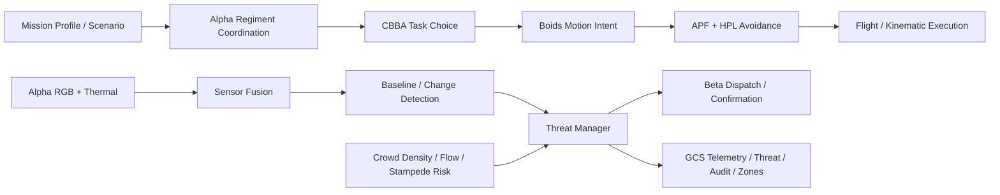

# System Architecture

This document describes the current, authoritative Project Sanjay MK2 architecture for the police deployment program.

## 1. Mission Baseline

The system is built around a two-tier police surveillance fleet:

| Tier | Count | Altitude | Payload | Mission role |
|------|-------|----------|---------|--------------|
| Alpha | 6 | 65 m | RGB + thermal + 3D LiDAR | Wide-area patrol, anomaly detection, geometry awareness |
| Beta | 1 | 25 m | 1080p RGB | Close visual confirmation and operator-readable evidence |

The mission target is state police urban operations, especially:

- high-rise surveillance
- crowd monitoring
- stampede-risk detection
- suspicious person and vehicle detection
- operator-supervised confirmation and evidence capture

## 2. Runtime Layers

### 2.1 Alpha surveillance loop

The Alpha loop is the main surveillance path:

1. Alpha drones patrol sectors under decentralized regiment coordination.
2. RGB and thermal observations are captured and fused.
3. Fused observations are compared against the baseline map.
4. New objects or thermal anomalies become `ChangeEvent`s.
5. `ThreatManager` scores and tracks them through the threat lifecycle.

LiDAR is part of the Alpha deployed stack, but in the current codebase it is primarily used for geometry and avoidance integration rather than deep semantic threat classification.

### 2.2 Beta confirmation loop

The Beta loop is intentionally narrower:

1. Beta remains available for confirmation rather than broad patrol sensing.
2. When a threat crosses the configured threshold, Beta is dispatched.
3. Beta captures close-range RGB evidence for operator review and threat confirmation.

Beta is not part of the deployed thermal or LiDAR path in the current architecture.

### 2.3 Swarm autonomy loop

The current autonomy path is decentralized:

- `CBBA` selects tasks per Alpha drone
- `Boids` generates motion intent and local flock behavior
- `APF + HPL` enforces local obstacle avoidance and safety gating
- Gossip/state-sync components provide peer-awareness without a centralized flight controller

This is the strongest and most mature part of the repo.

### 2.4 Crowd-intelligence loop

For police-event operations, the system also runs:

- crowd density estimation
- crowd flow analysis
- stampede risk scoring
- zone-aware GCS outputs

This path feeds the threat lifecycle and the GCS but remains simulation-first until real camera and thermal data are introduced.

### 2.5 GCS loop

The GCS path exposes:

- drone state and telemetry
- threat feed
- crowd updates
- zone updates
- evidence recording events
- audit stream

The current implementation uses an in-process WebSocket server and in-memory audit history. The planned MQTT/Kafka pipeline is designed but not yet the shipped runtime path.

## 3. Simulation Architecture

There are two practical simulation modes.

### 3.1 Fast Python simulation

The fast path uses the scenario framework and lightweight kinematic drones:

- world model and terrain generation
- scheduled threat/object spawns
- surveillance pipeline execution
- crowd intelligence execution
- GCS output generation

This path is best for logic validation, repeatability, and regression testing.

### 3.2 Isaac Sim integration

The high-fidelity path uses Isaac Sim plus ROS 2:

- [scripts/isaac_sim/create_surveillance_scene.py](/Users/archishmanpaul/Desktop/Sanjay_MK2/scripts/isaac_sim/create_surveillance_scene.py) creates the police surveillance arena
- [config/isaac_sim.yaml](/Users/archishmanpaul/Desktop/Sanjay_MK2/config/isaac_sim.yaml) defines the deployed topic contract
- [src/integration/isaac_sim_bridge.py](/Users/archishmanpaul/Desktop/Sanjay_MK2/src/integration/isaac_sim_bridge.py) converts ROS 2 topics into runtime observations

The canonical ROS 2 topic contract is:

- Alpha: `rgb`, `thermal`, `lidar_3d`, `odom`, `imu`, `cmd_vel`
- Beta: `rgb`, `odom`, `imu`, `cmd_vel`

## 4. Current Implementation Status

### Implemented

- Police deployment config and mission profile loading
- Alpha/Beta fleet model with the current deployed sensor contract
- Decentralized coordination and avoidance
- RGB + thermal fusion and heuristic change detection
- Threat lifecycle management and Beta dispatch
- Crowd intelligence modules
- Scenario framework and 50 police scenarios
- GCS server and dashboard integration
- Isaac Sim bridge and scene generation

### Designed but not yet fully implemented

- TIDE learned multimodal threat identification
- Mission-policy and response orchestration layer
- Durable telemetry/threat data pipeline beyond the in-process GCS path
- Full hardware-backed calibration and field validation

## 5. Simulation Vs Hardware Boundary

### What simulation can validate well

- swarm tasking and patrol behavior
- detection pipeline contracts
- degraded-sensor handling logic
- GCS event flows
- police scenario coverage and response timing

### What requires real hardware

- LiDAR performance in real urban conditions
- thermal fidelity and false-positive behavior
- RGB imaging quality at operational altitude
- payload power/weight effects
- actual radio, GNSS, flight stability, and endurance behavior

## 6. Architectural Principle

The current repo should be read as:

- a credible police-simulation and autonomy platform today
- a partial field-system foundation
- not yet the final deployable autonomous drone product

That distinction matters. The architecture is now aligned to the intended fleet and sensor contract, but the road from simulation to field deployment still runs through perception upgrades, response-policy implementation, and real hardware validation.
