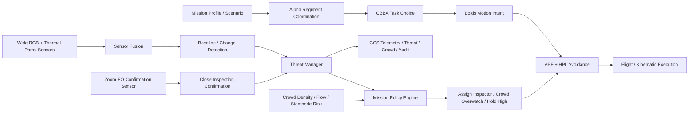

# System Architecture

This document describes the current Project Sanjay MK2 architecture as it exists in the repo today.

## Mission Baseline

The authoritative police deployment model is:

| Attribute | Current target |
|----------|----------------|
| Customer | State Police |
| Fleet | `6` homogeneous `Alpha` drones |
| Patrol altitude | `65 m` nominal |
| Inspection altitude | `35 m` nominal |
| Sensor suite | `wide RGB + zoom EO + thermal + 3D LiDAR + IMU/odometry` |
| Confirmation model | Alpha self-confirmation under mission-policy gating |

## Top-Level Runtime Model

## Runtime Layers

### 1. Swarm coordination

The strongest part of the repo remains the decentralized swarm layer:

- `AlphaRegimentCoordinator` manages sector ownership and patrol geometry
- `CBBA` handles task choice
- `Boids` produces motion intent
- `APF + HPL` provides local avoidance and safety gating

This layer is mature enough for simulation-led mission work.

### 2. Surveillance and threat detection

The patrol sensing path is currently:

- wide RGB patrol camera
- thermal camera
- sensor fusion
- baseline-map comparison
- change detection
- threat lifecycle management

This is still mostly heuristic/rule-based, not yet learned multimodal perception.

### 3. Mission policy

The repo now has a deterministic mission-policy layer in [mission_policy.py](/Users/archishmanpaul/Desktop/Sanjay_MK2/src/response/mission_policy.py).

Its role is to decide whether the swarm should:

- continue patrol
- track a threat from high altitude
- assign an Alpha inspector
- execute a facade scan
- perform target confirmation
- retask for crowd overwatch
- abort and stay safe

Close inspection is allowed only when:

- multiple sensors support the threat
- threat score exceeds the critical threshold
- corridor safety is acceptable
- coverage repair is acceptable

### 4. Close confirmation

Close confirmation is no longer modeled as a separate Beta aircraft in the authoritative path.

Instead:

- one Alpha is selected as the inspector
- that Alpha descends or performs a facade scan
- the zoom EO camera is used for close confirmation
- the rest of the swarm backfills coverage

### 5. Crowd-risk path

The crowd path remains high-altitude by default:

- crowd density estimation
- crowd flow analysis
- stampede-risk scoring
- GCS alerting
- overhead retasking

Crowd workflows do not descend unless that behavior is explicitly added later.

### 6. GCS

The GCS runtime surface currently exposes:

- map updates
- per-drone telemetry
- threat events
- crowd/stampede outputs
- zone updates
- evidence hooks
- audit stream

The runtime GCS path is still the in-process WebSocket server, not the planned durable event/data pipeline.

## Simulation Architecture

### Fast police-scenario path

The most aligned runtime path is the scenario framework:

- [src/simulation/scenario_loader.py](/Users/archishmanpaul/Desktop/Sanjay_MK2/src/simulation/scenario_loader.py)
- [src/simulation/scenario_executor.py](/Users/archishmanpaul/Desktop/Sanjay_MK2/src/simulation/scenario_executor.py)
- [config/scenarios](/Users/archishmanpaul/Desktop/Sanjay_MK2/config/scenarios)

This path is where the Alpha-only mission-policy architecture is implemented and tested.

### Isaac Sim path

The Isaac path is still relevant for high-fidelity topic integration, but it is not perfectly uniform with the new authoritative architecture.

Current truth:

- Alpha ROS topics are aligned around `rgb`, `thermal`, `lidar_3d`, `odom`, `imu`, `cmd_vel`
- the Isaac bridge remains compatible with a legacy `beta_0` entry
- the Isaac scene builder still spawns a Beta in its current script

That means the Isaac path is best understood as:

- useful for integration and topic-validation work
- partially legacy in fleet composition
- not the sole source of truth for deployment architecture

## Current Status

### Implemented now

- Alpha-only police config in [config/police_deployment.yaml](/Users/archishmanpaul/Desktop/Sanjay_MK2/config/police_deployment.yaml)
- mission-policy data types in [drone_types.py](/Users/archishmanpaul/Desktop/Sanjay_MK2/src/core/types/drone_types.py)
- deterministic mission policy in [mission_policy.py](/Users/archishmanpaul/Desktop/Sanjay_MK2/src/response/mission_policy.py)
- zoom EO sensor simulation in [zoom_camera.py](/Users/archishmanpaul/Desktop/Sanjay_MK2/src/single_drone/sensors/zoom_camera.py)
- Alpha-only inspection logic in [scenario_executor.py](/Users/archishmanpaul/Desktop/Sanjay_MK2/src/simulation/scenario_executor.py)
- inspector-aware threat handling in [threat_manager.py](/Users/archishmanpaul/Desktop/Sanjay_MK2/src/surveillance/threat_manager.py)
- GCS telemetry reflecting mission/inspection/backfill state in [gcs_server.py](/Users/archishmanpaul/Desktop/Sanjay_MK2/src/gcs/gcs_server.py)

### Not implemented yet

- learned multimodal threat identification on real data
- production-grade facade/window semantic analysis
- real-sensor synchronization and calibration
- hardware-in-the-loop validation
- complete removal of legacy Beta compatibility from the Isaac-facing path

## Simulation vs Hardware Boundary

### Simulation can validate

- sector ownership and backfill
- swarm patrol coordination
- obstacle avoidance logic
- mission-policy gating
- facade scan path generation
- crowd-overwatch retasking
- GCS event flow

### Hardware is still required for

- real LiDAR fidelity
- real thermal behavior
- real RGB evidence quality
- endurance and payload validation
- wind, RF, GNSS, and flight safety proof

## Architectural Principle

The cleanest way to read the repo today is:

- `authoritative mission architecture`: Alpha-only police swarm
- `strongest implementation surface`: scenario framework
- `highest-fidelity integration surface`: Isaac Sim bridge
- `largest remaining gap`: learned perception plus real hardware proof
