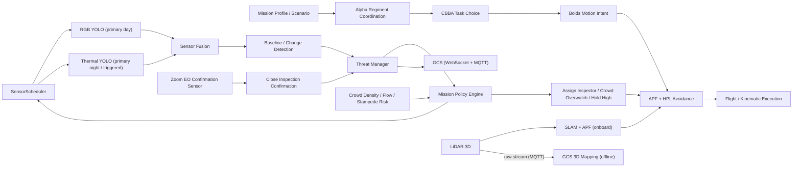
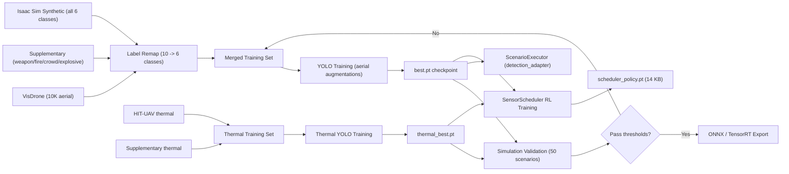

# System Architecture

This document describes the current Project Sanjay MK2 architecture as it exists in the repo today, including the sensor-adaptive AI architecture adopted 2026-04-18.

---

## Mission Baseline

The authoritative police deployment model is:

| Attribute | Current target |
|----------|----------------|
| Customer | State Police |
| Fleet | `6` homogeneous `Alpha` drones |
| Patrol altitude | `65 m` nominal |
| Inspection altitude | `35 m` nominal |
| Sensor suite | `wide RGB + zoom EO + thermal (LWIR) + 3D LiDAR + IMU/odometry` |
| Confirmation model | Alpha self-confirmation under mission-policy gating |
| Edge compute | Jetson Orin Nano 8 GB (40 TOPS, 15 W TDP) |

---

## Top-Level Runtime Model



---

## Sensor-Adaptive AI Architecture

Adopted 2026-04-18.  Replaces the earlier TIDE "always-on tri-modal fusion" design.

### Design Principle

Instead of running all perception pipelines on every frame (which saturates the Jetson power and thermal budget), the system dynamically activates only the perception pipelines that matter for the current operational context.

### Sensor Roles (Authoritative)

| Sensor | Role | AI model | Runs on | Scheduling |
|--------|------|----------|---------|------------|
| Wide RGB | Primary patrol detection (day) | YOLO11s (police classes) | Onboard Jetson | Adaptive FPS (2-30) |
| Thermal LWIR | Primary detection (night); triggered detection (day: occlusion, confirmation, fire) | Thermal YOLO (person, vehicle, fire) | Onboard Jetson | Adaptive FPS (0-30) |
| Zoom EO | Close inspection confirmation | YOLO or heuristic | Onboard Jetson | On-demand (inspection phase only) |
| 3D LiDAR | GPS-denied navigation (SLAM), obstacle avoidance (APF) | None (geometric algorithms) | Onboard Jetson | Always-on, lightweight |
| 3D LiDAR stream | Offline 3D mapping, building reconstruction, forensic scene capture | None (point cloud registration) | GCS workstation | Raw stream via MQTT |

**LiDAR is a navigation sensor, not a surveillance sensor.** RGB and thermal together cover 100% of the detection needs for the target police classes.  LiDAR adds no detection value on top of thermal + RGB for person, vehicle, weapon, fire, explosive, or crowd classes at drone altitude.  LiDAR earns its weight through GPS-denied autonomy and obstacle avoidance.

### Compute Budget

| Mode | RGB YOLO | Thermal YOLO | LiDAR SLAM | Total Jetson |
|------|----------|--------------|------------|--------------|
| Day patrol | 15 FPS (~30%) | OFF | ~5% | **~35%** |
| Night patrol | 5 FPS (~12%) | 15 FPS (~20%) | ~5% | **~37%** |
| Dual inspect | 15 FPS (~30%) | 15 FPS (~20%) | ~5% | **~55%** |
| Emergency burst | 30 FPS (~50%) | 30 FPS (~35%) | ~5% | **~90%** (short burst) |

Normal operations leave 45-65% headroom for flight controller, telemetry, comms, logging, and thermal margin.

### When Thermal MUST Activate During Day

| Scenario | Why RGB fails | Thermal advantage |
|----------|--------------|-------------------|
| Person in dense foliage | RGB sees leaves | 37 C body heat through canopy |
| Tinted vehicle occupants | Dark glass reflects sky | Body heat through side windows |
| Interior / early-stage fire | No visible smoke yet | Hot-spot on wall surface |
| Person prone on rooftop | Blends with sun-heated concrete | Temperature contrast (inverted) |
| Post-explosion casualty search | Dust cloud blinds RGB | Thermal penetrates dust/smoke |
| Stampede: fallen persons in crowd | Can't distinguish fallen vs standing | Stationary heat vs moving flow |
| Person under bridge/overpass | Structural occlusion | Heat from oblique angle |
| Person in water (SAR) | Glare and ripples hide head | Head at 35 C vs cold water |
| Drug lab / grow-op detection | Normal building exterior | Anomalous heat exhaust |
| Sun-glare blown-out facade | Auto-exposure fights glare | Immune to visible light |

### When RGB MUST Stay Active at Night

| Scenario | Why thermal fails | RGB advantage |
|----------|------------------|---------------|
| License plate reading | Cannot read text | IR-illuminated plate capture |
| Weapon type identification | Blob, not shape detail | Silhouette distinction (gun vs phone) |
| Facial features / clothing | No color or texture | Descriptors for dispatch |
| Color recognition (vehicle, clothing) | Monochrome heat | Color only exists in visible spectrum |
| Muzzle flash detection | Flash is visible-spectrum | Direction and location from flash |
| Evidence documentation (court) | Interpretive, not court-standard | Universal evidence format |
| Person vs animal distinction | Both 37 C | Two legs vs four, fur vs clothing |
| Text / signage / graffiti | Cannot see text | Content capture for evidence |
| Traffic signal state | LEDs emit no heat | Red / green / yellow visible |

---

## SensorScheduler Design

### Three-Layer Architecture

```
+---------------------------------------------------+
|  Layer 1: HARD RAILS (deterministic, inviolable)   |
|                                                    |
|  - Thermal MUST activate if lux < 10               |
|  - RGB MUST stay on (min 2 FPS) for evidence chain |
|  - Both MUST activate during INSPECT mission phase |
|  - Both MUST activate when weapon_person conf      |
|    > 0.3 on either sensor                          |
|  - LiDAR SLAM never turns off                      |
|  - Operator override always honored                |
|                                                    |
|  Non-negotiable. No learning overrides them.       |
|  Auditable policy constraints for law enforcement. |
+---------------------------------------------------+
|  Layer 2: LEARNED POLICY NETWORK                   |
|                                                    |
|  A tiny RL-trained policy that decides:            |
|  - RGB FPS (2, 5, 10, 15, 30)                     |
|  - Thermal FPS (0, 5, 10, 15, 30)                 |
|                                                    |
|  ~3,500 parameters, <0.1 ms inference.             |
|  Trained via PPO in simulation.                    |
+---------------------------------------------------+
|  Layer 3: META-DETECTION FEEDBACK                  |
|                                                    |
|  Detection outputs from RGB/thermal YOLO feed      |
|  back into the scheduler as state features:        |
|                                                    |
|  "RGB confidence dropped on this target"           |
|  -> scheduler boosts thermal                       |
|                                                    |
|  "Thermal sees anomaly RGB didn't detect"          |
|  -> scheduler boosts RGB for identification        |
+---------------------------------------------------+
```

### Scheduling State Machine

```
                    +-------------+
         ambient    |   STARTUP   |
         light      |  (all off)  |
         check      +------+------+
                           |
              +------------+------------+
              v                         v
     +----------------+      +-----------------+
     |   DAY_PATROL   |      |  NIGHT_PATROL   |
     |  RGB: 15 FPS   |      |  Thermal: 15 FPS|
     |  Thermal: OFF  |      |  RGB: 5 FPS dim |
     |  LiDAR: SLAM   |      |  LiDAR: SLAM    |
     +-------+--------+      +--------+--------+
             |                         |
        threat / occlusion         threat detected
        detected                       |
             |    +--------------------+
             v    v
     +-----------------+       +------------------+
     |  INSPECT_DUAL   |       |  EMERGENCY_BURST |
     |  RGB: 15 FPS    |       |  RGB: 30 FPS     |
     |  Thermal: 15 FPS|       |  Thermal: 30 FPS |
     |  Zoom EO: active|       |  (short duration) |
     +-----------------+       +------------------+
```

### Policy Network Specification

**Input features (state vector, ~30 dimensions):**

```
Environment:
  ambient_lux                 float   0-100000
  sun_elevation_angle         float   -90 to 90 (deg)
  time_of_day_sin_cos         float   cyclic encoding
  temperature_ambient         float   celsius
  weather_category            one-hot clear/cloudy/rain/fog/smoke

Scene context:
  terrain_type                one-hot open/urban/forest/water/building
  altitude_agl                float   meters
  drone_velocity              float   m/s
  mission_phase               one-hot patrol/track/inspect/overwatch/rtb

RGB detector feedback:
  rgb_max_confidence          float   0-1
  rgb_mean_confidence         float   0-1
  rgb_num_detections          int
  rgb_uncertain_count         int     detections with conf 0.2-0.5
  rgb_exposure_quality        float   0-1
  rgb_blur_score              float   0-1

Thermal detector feedback:
  thermal_max_confidence      float   0-1
  thermal_mean_confidence     float   0-1
  thermal_num_detections      int
  thermal_contrast_ratio      float   target-to-background delta

History:
  missed_detection_streak     int     frames since last high-conf detection
  sensor_switch_cooldown      float   seconds since last mode change
  recent_threat_level         float   decayed threat score
```

**Output (discrete action space):**

```
rgb_mode:     [OFF, 2_FPS, 5_FPS, 10_FPS, 15_FPS, 30_FPS]
thermal_mode: [OFF, 5_FPS, 10_FPS, 15_FPS, 30_FPS]
```

6 x 5 = 30 possible actions.  Hard rails mask illegal combinations (e.g., both OFF is never allowed).

**Network:** `Input(30) -> Dense(64, ReLU) -> Dense(32, ReLU) -> Dense(30, Softmax)`

Total parameters: ~3,500.  Model size: ~14 KB.  Runs on ARM Cortex-M4 or Jetson CPU.

### RL Training Design

**Environment:** The existing scenario executor (`src/simulation/scenario_executor.py`) with the 50 YAML police scenarios, randomized across time-of-day, weather, and lighting.

**Episode structure:**
1. Load a random scenario with randomized environment conditions.
2. Run the drone on patrol.  Every 0.5 s the scheduler picks a sensor configuration.
3. Both RGB and thermal YOLO run on the simulated scene (ground truth is known).
4. Compare detections against ground truth.
5. Compute reward.  Update policy via PPO.

**Reward function:**

```
R(t) = detection_reward - alpha * compute_cost - beta * switch_penalty

detection_reward =
    sum of correct detections weighted by class priority
  + bonus for cross-modal catch (one sensor found what the other missed)
  - penalty for each ground-truth object neither sensor detected

compute_cost = (rgb_fps / 30 + thermal_fps / 30)   # normalized

switch_penalty = small constant when mode changes
                 (prevents rapid oscillation)
```

Class priority weights (higher = more important to detect):

| Class | Priority | Rationale |
|-------|----------|-----------|
| weapon_person | 5.0 | Highest operational consequence |
| fire | 3.0 | Time-critical safety |
| explosive_device | 5.0 | Highest operational consequence |
| person | 1.0 | Baseline importance |
| vehicle | 0.5 | Usually non-threatening |
| crowd | 2.0 | Stampede risk |

**Training data:** No real-world labeled data needed.  Ground truth comes from the simulation world model.  The scheduler learns from paired RGB + thermal detector outputs against known object positions.

**Prerequisite:** Both the RGB YOLO model (`police_full_v2.pt`) and the thermal YOLO model (trained on HIT-UAV + supplementary thermal data) must exist before scheduler training begins.

---

## Runtime Layers

### 1. Swarm coordination

The strongest part of the repo remains the decentralized swarm layer:

- `AlphaRegimentCoordinator` manages sector ownership and patrol geometry
- `CBBA` handles task choice
- `Boids` produces motion intent
- `APF + HPL` provides local avoidance and safety gating

This layer is mature enough for simulation-led mission work.

### 2. Surveillance and threat detection

The patrol sensing path is:

- **SensorScheduler** selects active sensors and FPS for current context
- active sensors (RGB YOLO and/or thermal YOLO) produce detections
- **SensorFusionPipeline** merges RGB + thermal detections (confidence boost on corroboration)
- baseline-map comparison and change detection
- **ThreatManager** lifecycle management (new / tracking / confirmed / cleared)

Current implementation is heuristic sensors + rule-based fusion.  Trained YOLO models plug in via the `DetectionModelAdapter` interface.

### 3. Mission policy

The deterministic mission-policy layer (`mission_policy.py`) decides whether the swarm should:

- continue patrol
- track a threat from high altitude
- assign an Alpha inspector
- execute a facade scan
- perform target confirmation
- retask for crowd overwatch
- abort and stay safe

Close inspection is allowed only when:

- multiple sensors support the threat (multi-sensor evidence gate)
- threat score exceeds the critical threshold
- LiDAR corridor safety is acceptable
- coverage repair is acceptable

The mission policy also feeds context back to the SensorScheduler (mission phase transitions trigger sensor mode changes).

### 4. Close confirmation

One Alpha is selected as inspector, descends or performs facade scan, uses zoom EO for close confirmation.  The rest of the swarm backfills coverage.  Close confirmation is NOT a separate Beta aircraft.

### 5. Crowd-risk path

Crowd workflows are high-altitude by default:

- crowd density estimation
- crowd flow analysis
- stampede-risk scoring
- GCS alerting
- overhead retasking (no descent)

### 6. LiDAR subsystem

LiDAR has two distinct roles:

**Onboard (always-on, lightweight):**
- SLAM for GPS-denied position estimation in urban canyons
- APF obstacle avoidance (wire, pole, tree detection via 3D clustering)
- Corridor safety boolean for mission policy descent gating

**GCS (streamed, offline):**
- Raw compressed point clouds streamed via MQTT (~2-5 Mbps per drone)
- 3D building reconstruction for inspection path planning
- Forensic scene capture for post-incident analysis
- No AI inference -- geometric processing only (ICP, point cloud registration)

### 7. GCS

The GCS runtime surface exposes:

- map updates and per-drone telemetry
- threat events and crowd/stampede outputs
- zone updates and evidence hooks
- audit stream
- 3D map visualization (from LiDAR stream)
- sensor health and scheduler state

Runtime GCS uses WebSocket for real-time UI.  MQTT is the drone-to-GCS data transport for sensor streams and telemetry.

---

## Edge AI Model Stack

### Police detection classes

```
0: person
1: weapon_person
2: vehicle
3: fire
4: explosive_device
5: crowd
```

### Models

| Model | Sensor | Architecture | Training data | Deployment |
|-------|--------|-------------|---------------|------------|
| RGB police model | Wide RGB | YOLO11s | VisDrone + weapons + fire + crowd + explosives | TensorRT FP16 on Jetson |
| Thermal police model | Thermal LWIR | YOLO11s (smaller) | HIT-UAV + thermal fire + supplementary | TensorRT FP16 on Jetson |
| SensorScheduler | N/A (meta) | MLP 3,500 params | RL (PPO) in simulation | CPU on Jetson or flight controller |
| Crowd density model | Wide RGB | CSRNet / DM-Count | ShanghaiTech + DroneCrowd | ONNX on Jetson |

### Confidence thresholds (from TIDE spec, retained)

| Class | Detection threshold | Confirmation threshold |
|-------|--------------------|-----------------------|
| weapon_person | 0.30 | 0.70 |
| fire | 0.40 | 0.65 |
| explosive_device | 0.30 | 0.70 |
| person | 0.50 | 0.75 |
| vehicle | 0.50 | 0.75 |
| crowd | 0.25 | 0.60 |

Detection threshold: minimum confidence for the SensorScheduler to consider a detection real (and potentially trigger the other sensor for cross-modal verification).  Confirmation threshold: minimum for mission policy to act on the detection.

### Deployment target

- Jetson Orin Nano 8 GB
- TensorRT INT8/FP16 inference
- ONNX intermediate format
- Target: RGB YOLO < 10 ms/frame, thermal YOLO < 8 ms/frame at 640px

---

## Edge AI Training Pipeline



Key files:

- RGB training: `scripts/train_yolo.py`, `config/training/visdrone_police.yaml`
- Validation: `scripts/validate_model.py`, `src/simulation/model_validator.py`
- Adapters: `src/simulation/model_adapter.py` (6 backends)
- Data: `scripts/prepare_supplementary_data.py` (weapons, fire, crowd, explosive, thermal)
- Isaac synthetic: `scripts/isaac_sim/generate_synthetic_dataset.py`
- Colab: `notebooks/train_yolo_police.ipynb` (Day 2), `notebooks/train_yolo_police_day3.ipynb` (Day 3)

---

## Simulation Architecture

### Fast police-scenario path

The most aligned runtime path is the scenario framework:

- `src/simulation/scenario_loader.py`
- `src/simulation/scenario_executor.py`
- `config/scenarios/` (50 YAML police scenarios)

This path is where the Alpha-only mission-policy architecture is implemented and tested.  The scenario executor accepts an optional `detection_adapter` parameter to swap heuristic sensors for trained YOLO models.

### Known Sim-to-Real Gap (validator)

The scenario validator (`scripts/validate_model.py`) uses `_render_bev()` in `model_adapter.py` to generate input frames for detection adapters.  `_render_bev()` produces a stylized abstract image (gray background + colored circles per object type) -- not photo-realistic content.

This means:

- **Heuristic adapters** work correctly (they query the `WorldModel` directly, never touch the render).
- **YOLO models trained on real photos** cannot detect objects in BEV renders.  They produce P=0, R=0 across scenarios.  This is not a model quality bug -- it's that the input distribution doesn't match training.
- **Models trained on synthetic BEV renders or Isaac Sim photorealistic output** would work.

For real-photo-trained YOLO, the authoritative accuracy metric is the held-out val set mAP (computed by Ultralytics during training).  The scenario validator is meaningful only after one of:

1. Isaac Sim photorealistic rendering integrated into the adapter flow (Phase 6 HIL)
2. BEV renderer rewritten to produce photo-realistic frames (significant work)
3. Hardware field validation with real sensor feeds (Phase 6+)

This gap is documented in `reports/day3/validation_summary.md`.

### Isaac Sim path

The Isaac path provides high-fidelity sensor simulation and ROS 2 topic integration.  It is partially aligned with the authoritative architecture:

- Alpha ROS topics: `/alpha_N/rgb/image_raw`, `/alpha_N/thermal/image_raw`, `/alpha_N/lidar_3d/points`, `/alpha_N/odom`, `/alpha_N/imu`, `/alpha_N/cmd_vel`
- The Isaac bridge retains a legacy `beta_0` entry (compatibility, not authoritative)
- The Isaac scene builder still spawns a Beta drone (to be removed)

Isaac is useful for integration, topic validation, and synthetic data generation.  It is not the sole source of truth for deployment architecture.

---

## Current Status

### Implemented now

- Alpha-only police config in `config/police_deployment.yaml`
- mission-policy data types in `src/core/types/drone_types.py`
- deterministic mission policy in `src/response/mission_policy.py`
- zoom EO sensor simulation in `src/single_drone/sensors/zoom_camera.py`
- Alpha-only inspection logic in `src/simulation/scenario_executor.py`
- inspector-aware threat handling in `src/surveillance/threat_manager.py`
- GCS telemetry in `src/gcs/gcs_server.py`
- pluggable detection model adapters (YOLO, YOLO+SAHI, thermal YOLO, crowd density, ONNX)
- post-training simulation validation engine
- YOLO training pipeline with VisDrone + multi-source supplementary merge
- supplementary dataset acquisition (weapons from OpenImages/YouTube-GDD/Kaggle, fire from D-Fire/Kaggle aerial, crowd from ShanghaiTech, thermal from HIT-UAV, explosive via Roboflow ZIP import)
- Isaac Sim synthetic data pipeline
- sensor degradation simulation (`DegradedSensorWrapper`)

### In progress (Day 3)

- RGB YOLO `police_full_v2` training with real weapon data (~8,500+ weapon images)
- weapon_person mAP50 target: > 0.10 (Day 2 baseline: 0.019)

### Not implemented yet

- **SensorScheduler** (the adaptive sensor scheduling component designed above)
- **thermal YOLO model** (training data acquired via HIT-UAV; model not yet trained)
- **SensorScheduler RL training** (requires both RGB and thermal models first)
- trained explosive_device detection (data available via Roboflow ZIPs; not yet merged/trained)
- production facade/window semantic analysis
- real-sensor synchronization and calibration
- hardware-in-the-loop validation
- complete removal of legacy Beta compatibility from the Isaac-facing path
- MQTT drone-to-GCS transport (designed in GCS Pipeline spec; not yet implemented)

---

## Simulation vs Hardware Boundary

### Simulation can validate

- sector ownership and backfill
- swarm patrol coordination
- obstacle avoidance logic
- mission-policy gating
- facade scan path generation
- crowd-overwatch retasking
- GCS event flow
- SensorScheduler policy (via RL training in simulation)
- RGB and thermal YOLO accuracy (via scenario executor with trained adapters)

### Hardware is still required for

- real LiDAR fidelity and SLAM accuracy
- real thermal behavior (urban heat clutter, weather, calibration)
- real RGB evidence quality (blur, glare, haze, long-range)
- sensor synchronization and cross-calibration
- endurance and payload validation
- wind, RF, GNSS, and flight safety proof
- actual onboard compute thermal management

---

## Architectural Principle

The cleanest way to read the repo today is:

- **authoritative mission architecture:** Alpha-only police swarm
- **authoritative sensor architecture:** sensor-adaptive scheduling (RGB primary day, thermal triggered/primary night, LiDAR navigation-only)
- **strongest implementation surface:** scenario framework
- **highest-fidelity integration surface:** Isaac Sim bridge
- **perception training surface:** YOLO pipeline + simulation validation
- **largest remaining gaps:** SensorScheduler implementation, thermal YOLO training, real hardware proof

---

## Superseded Designs

The following earlier design documents have been archived to `docs/superpowers/_archived/`:

| Document | Why superseded |
|----------|---------------|
| TIDE spec (tri-modal always-on fusion) | Replaced by sensor-adaptive scheduling with separate per-modal YOLO models and LiDAR as navigation-only |
| TIDE plans 1-5 | Implementation plans for the superseded TIDE architecture |
| SRO-MP spec (swarm response orchestration) | Built around 6 Alpha + 1 Beta fleet model; `src/response/mission_policy.py` is the authoritative Alpha-only implementation |

Useful elements extracted from TIDE into this document: class maps, confidence thresholds, deployment targets, edge compute specifications.
