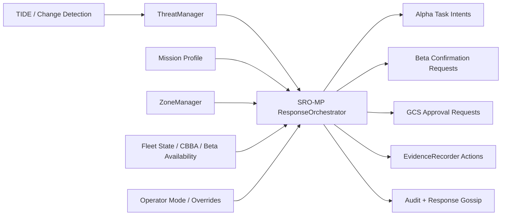

# SRO-MP — Swarm Response Orchestration & Mission Policy

**Module:** `src/response/`
**Author:** Archishman Paul
**Date:** 2026-03-23
**Status:** Design Proposed

---

## 1. Overview

SRO-MP is the post-detection response layer for Sanjay MK2. It converts `ThreatManager` outputs into mission-aware swarm actions, Beta confirmation requests, operator approval prompts, zone alerts, and evidence-recording actions for police deployment scenarios.

TIDE answers "what might be there." SRO-MP answers "what should the swarm do next."

### Primary Purpose

- Bind threat detections to police mission profiles already present in the project
- Turn threat state into deterministic swarm tasking and operator-visible plans
- Keep Alpha and Beta behavior auditable, overrideable, and safe under degraded conditions
- Reuse the existing `ThreatManager`, `AlphaRegimentCoordinator`, `ZoneManager`, `GCSServer`, and `EvidenceRecorder`

### Hard Boundaries

- SRO-MP does **not** perform neural inference
- SRO-MP does **not** replace `ThreatManager` lifecycle tracking
- SRO-MP does **not** authorize any kinetic action or autonomous use of force
- SRO-MP does **not** remove operator override authority

### Key Constraints

| Constraint | Value |
|---|---|
| Decision latency | <100ms per evaluation cycle on GCS or leader Alpha |
| Decision cadence | 5 Hz policy evaluation, event-driven immediate re-evaluation |
| Deployment model | Decentralized-first with GCS-assisted approvals |
| Swarm types | 6 Alpha + 1 Beta baseline |
| Inputs | Threats, zones, mission profile, fleet state, operator mode |
| Auditability | Every decision, override, approval, and task emission logged |
| Safety | Default-to-observe when confidence or comms are degraded |

---

## 2. Problem Statement

The current stack has:

- Per-drone perception and anomaly detection
- Threat lifecycle tracking and Beta confirmation dispatch
- Decentralized Alpha task allocation
- GCS audit, zones, and evidence recording

What is missing is the policy layer between detection and response. Today the system can detect and track threats, but it does not centrally specify:

- Which mission profile should bias response behavior
- When a threat triggers Alpha retasking versus Beta dispatch
- Which actions require operator acknowledgment or explicit approval
- When recordings should start automatically
- How zone context changes severity and task priority
- How multiple threats compete for limited swarm resources

SRO-MP fills that gap.

---

## 3. Architecture

### 3.1 Control Position in the Stack



### 3.2 Integration with Existing Codebase

- **Consumes:** `ThreatManager.get_active_threats()` and threat lifecycle transitions
- **Consumes:** `MissionProfile` / mission config, `ZoneManager`, Alpha/Beta availability
- **Uses:** existing CBBA `SwarmTask` pipeline for Alpha retasking
- **Uses:** existing `ThreatManager.request_confirmation(...)` for Beta dispatch
- **Uses:** existing `GCSServer.emit_threat_event(...)` and `emit_audit(...)`
- **Uses:** existing `EvidenceRecorder.start_recording(...)`
- **Publishes:** response plans, approval requests, execution state, and gossip payloads

### 3.3 Old vs New Decision Path

**Current path:**
```
Detection → ThreatManager → optional Beta dispatch / manual GCS override
```

**New path with SRO-MP:**
```
Detection → ThreatManager → SRO-MP policy evaluation
→ ResponsePlan
→ Alpha tasks / Beta request / GCS approval / recording / audit / gossip
```

### 3.4 Execution Topology

SRO-MP runs in one of two modes:

1. **Primary mode:** on GCS or simulation runner, with full mission, zone, and operator context
2. **Fallback mode:** on elected Alpha leader with reduced authority when GCS is unavailable

The fallback mode may continue observation, tracking, and evidence actions, but any policy marked `operator_required=True` remains pending until operator connectivity returns.

---

## 4. Design Principles

- **Policy before action:** raw threat score alone never decides behavior
- **Mission-aware:** the same detection can produce different responses under `CROWD_EVENT` vs `VIP_PROTECTION`
- **Human-supervised:** high-impact actions surface to GCS with clear approval state
- **Auditable by default:** plans and transitions are serialized and logged
- **Resource-aware:** multiple threats compete against actual fleet capacity
- **Fail-safe:** uncertain identity, stale tracks, or comms loss reduce autonomy rather than amplify it

---

## 5. Type System

### 5.1 Core Enums

```python
class ResponseAction(Enum):
    OBSERVE = auto()              # Continue passive monitoring
    RETASK_ALPHA = auto()         # Emit or modify Alpha CBBA tasks
    REQUEST_BETA = auto()         # Ask ThreatManager to dispatch Beta
    START_RECORDING = auto()      # Start evidence capture
    UPDATE_ZONE_ALERT = auto()    # Raise zone alert level in GCS
    NOTIFY_OPERATOR = auto()      # Push a visible operator alert
    REQUIRE_APPROVAL = auto()     # Hold action pending operator decision
    RESOLVE_PLAN = auto()         # Close response plan


class ResponseState(Enum):
    PLANNED = auto()
    WAITING_APPROVAL = auto()
    APPROVED = auto()
    ACTIVE = auto()
    DEGRADED = auto()
    BLOCKED = auto()
    COMPLETED = auto()
    CANCELLED = auto()


class ApprovalMode(Enum):
    NONE = auto()
    ACK_ONLY = auto()
    EXPLICIT = auto()


class OperatorMode(Enum):
    NORMAL = auto()
    CONSERVATIVE = auto()
    HIGH_ALERT = auto()
    MANUAL_HOLD = auto()
```

### 5.2 Core Dataclasses

```python
@dataclass
class ThreatContext:
    threat_id: str
    object_type: str
    threat_level: ThreatLevel
    threat_score: float
    confidence: float
    position: Vector3
    detected_by: int
    status: ThreatStatus
    in_zone_types: list[str]
    zone_alert_levels: list[str]
    mission_type: MissionType
    age_s: float
    sensor_health: float
    track_stability: float
    friendly_confidence: float
    requires_visual_confirmation: bool


@dataclass
class FleetContext:
    available_alphas: list[int]
    available_betas: list[int]
    alpha_positions: dict[int, Vector3]
    beta_positions: dict[int, Vector3]
    alpha_battery: dict[int, float]
    beta_battery: dict[int, float]
    active_task_count: dict[int, int]
    gcs_connected: bool


@dataclass
class ResponsePlan:
    plan_id: str
    threat_id: str
    state: ResponseState
    priority: float
    actions: list[ResponseAction]
    alpha_tasks: list[SwarmTask]
    beta_request: bool
    approval_mode: ApprovalMode
    approval_reason: str
    recording_reason: str
    target_zone_updates: dict[str, str]
    created_at: float
    updated_at: float


@dataclass
class ApprovalRequest:
    request_id: str
    plan_id: str
    threat_id: str
    reason: str
    expires_at: float
    recommended_action: str
    requested_actions: list[ResponseAction]
```

### 5.3 Existing Type Extensions

`Threat` remains the system of record for lifecycle state. SRO-MP adds response metadata externally rather than expanding `ThreatStatus` immediately.

Optional additive fields on `Threat`:

- `response_plan_id`
- `response_priority`
- `response_state`
- `last_policy_eval_time`
- `operator_hold`

This keeps the existing detection-confirmation lifecycle stable while allowing richer orchestration.

---

## 6. Mission Policy Model

### 6.1 Policy Inputs

Each policy evaluation uses:

- Threat semantics from TIDE / `ThreatManager`
- Mission profile from `MissionType`
- Active operational zones from `ZoneManager`
- Operator mode from GCS
- Fleet availability and battery headroom
- Sensor health and track freshness

### 6.2 Response Priority Score

SRO-MP computes a response priority in `[0.0, 1.0]`:

```
priority =
    0.30 * threat_score
  + 0.20 * zone_criticality
  + 0.15 * mission_bias
  + 0.10 * threat_level_bias
  + 0.10 * recency_score
  + 0.10 * track_stability
  + 0.05 * reachability_score
```

Definitions:

- `zone_criticality`: derived from zone type and zone alert level
- `mission_bias`: profile-dependent weighting
- `recency_score`: decays with stale tracks
- `reachability_score`: based on available Alpha/Beta assets

### 6.3 Mission Bias Table

| Mission Type | Boosted Conditions | Preferred Initial Response |
|---|---|---|
| `BUILDING_PERIMETER` | perimeter breach, rooftop presence, facade-adjacent movement | Alpha focused scan + Beta if persistent |
| `CROWD_EVENT` | crowd surge, armed person in crowd, blocked exits | Alpha overhead track + record + selective Beta |
| `VIP_PROTECTION` | unknown person near VIP zone, converging vehicle, blind-spot activity | immediate operator alert + Beta bias |
| `EMERGENCY_RESPONSE` | fire, crowd crush, rapid zone escalation | recording + incident Alpha ring + Beta if useful |
| `AREA_LOCKDOWN` | any unauthorized entry into restricted area | aggressive Alpha track + operator alert + Beta bias |

### 6.4 Zone Criticality

Zone criticality base values:

| Zone Type | Base Criticality |
|---|---|
| `vip` | 1.00 |
| `restricted` | 0.90 |
| `staging_area` | 0.80 |
| `choke_point` | 0.75 |
| `exit_corridor` | 0.70 |
| none | 0.40 |

Alert modifiers:

- `normal`: +0.00
- `elevated`: +0.05
- `high`: +0.10
- `critical`: +0.15

### 6.5 Friendly Identification Policy

TIDE currently allows BLE to override detection class into `security_personnel`. For police deployment, SRO-MP refines this:

- BLE match contributes to `friendly_confidence`; it does not auto-suppress response by itself
- If BLE says friendly but the object is in a contradictory zone state or exhibits conflicting threat cues, the plan becomes `WAITING_APPROVAL`
- Friendly-marked detections may still trigger `OBSERVE` and `START_RECORDING`
- Automatic downgrade to low-priority monitoring is allowed only when:
  - BLE is recent
  - position match is stable
  - no contradictory object type or threat score spike exists

This avoids brittle policy behavior from a single post-processing override.

### 6.6 Aggressiveness Clamp

TIDE's aggressiveness slider affects detection confidence. SRO-MP caps its downstream effect by mission:

| Mission Type | Max Effective Aggressiveness |
|---|---|
| `CROWD_EVENT` | 0.65 |
| `BUILDING_PERIMETER` | 0.75 |
| `VIP_PROTECTION` | 0.80 |
| `EMERGENCY_RESPONSE` | 0.85 |
| `AREA_LOCKDOWN` | 0.90 |

SRO-MP uses the capped value for response thresholds so mission policy, not raw detector tuning, governs dispatch behavior.

---

## 7. Decision Logic

### 7.1 Baseline Response Bands

| Conditions | Response |
|---|---|
| `priority < 0.45` and no critical zone | `OBSERVE` |
| `0.45 <= priority < 0.65` | `OBSERVE + RETASK_ALPHA` |
| `0.65 <= priority < 0.80` | `RETASK_ALPHA + START_RECORDING + NOTIFY_OPERATOR` |
| `priority >= 0.80` | `RETASK_ALPHA + REQUEST_BETA + START_RECORDING + NOTIFY_OPERATOR` |

### 7.2 Approval Matrix

| Situation | Approval Mode |
|---|---|
| Alpha focused scan within current sector | `NONE` |
| Beta dispatch for medium/high confidence threat | `ACK_ONLY` |
| Beta dispatch into VIP or staging area | `EXPLICIT` |
| Plan conflicts with active operator hold | `EXPLICIT` |
| Contradictory friendly vs threat evidence | `EXPLICIT` |
| Auto-recording only | `NONE` |

### 7.3 Deterministic Rules

SRO-MP applies these before score bands:

1. `weapon_person` in any `vip` or `restricted` zone:
   - immediate recording
   - Alpha focused scan
   - Beta requested if available
   - operator notification mandatory

2. `crowd` or `crowd_risk` with `WARNING` or above:
   - incident coverage tasks emitted to nearest two Alpha drones
   - evidence recording enabled
   - Beta only if mission profile requests confirmation

3. `vehicle` approaching restricted or VIP zone:
   - create perimeter-monitor tasks for adjacent Alphas
   - operator alert if track remains stable for >3 cycles

4. `security_personnel` or high `friendly_confidence`:
   - continue observation only unless zone conflict or score spike appears

5. Stale track, poor sensor health, or conflicting classification:
   - downgrade autonomous action level by one band
   - retain operator notification if base priority >= 0.65

---

## 8. Alpha Task Synthesis

### 8.1 Task Emission Strategy

SRO-MP does not replace CBBA. It synthesizes tasks that the existing CBBA engine can allocate.

Primary mapping:

- focused threat observation -> `THREAT_INVESTIGATE`
- perimeter tightening near sensitive zone -> `PERIMETER_PATROL`
- crowd or exit-flow support -> `CORRIDOR_MONITOR` or `CROWD_OVERWATCH`
- incident-area support -> `INCIDENT_RESPONSE`
- VIP-area protective repositioning -> `VIP_OVERWATCH`

### 8.2 Alpha Allocation Rules

- At most 2 Alpha drones may be retasked per threat by default
- At least 4 Alpha drones remain on broad-area coverage unless mission profile says otherwise
- For simultaneous high-priority threats, one Alpha per threat is guaranteed before adding second observers
- Existing owner Alpha is preferred for continuity when battery and geometry are acceptable

### 8.3 Task Parameters

Each emitted `SwarmTask` includes:

- threat-centered position
- radius derived from object type and zone geometry
- priority from response priority
- deadline based on threat class
- required sensors for best-effort fit

Default task radii:

| Threat Type | Alpha Task Radius |
|---|---|
| `weapon_person` | 35m |
| `infiltrator` | 30m |
| `vehicle` | 40m |
| `crowd` / `crowd_risk` | 60m |
| `fire` / `explosive_device` | 45m |

---

## 9. Beta Dispatch Policy

### 9.1 Dispatch Preconditions

Beta dispatch is allowed only if:

- a Beta drone is available
- battery >= 25%
- target is reachable within mission-defined ETA
- no stronger active Beta assignment blocks dispatch
- approval mode requirements are satisfied

### 9.2 Dispatch Triggers

Default Beta request triggers:

- `priority >= 0.80`
- threat status is `PENDING_CONFIRMATION`
- object type is one of:
  - `weapon_person`
  - `infiltrator`
  - `vehicle`
  - `explosive_device`
- OR mission profile explicitly biases toward quick confirmation

### 9.3 Dispatch Denials

Beta request is blocked when:

- only weak or stale detection remains
- operator has placed a manual hold
- target entered a do-not-enter zone without approval
- conflicting plans would strand Beta away from a higher-priority active response

### 9.4 Reassignment

If a higher-priority threat appears:

- Beta may be reassigned only while current target is still `CONFIRMING`
- reassignment emits an audit event and a new approval request if the prior plan was operator-approved
- the original threat plan falls back to Alpha observation until Beta is available again

---

## 10. Operator Workflow & GCS Interface

### 10.1 New WebSocket Messages

SRO-MP adds:

- `response_plan`
- `response_status`
- `approval_request`
- `approval_resolution`
- `policy_alert`
- `evidence_state`

### 10.2 Message Semantics

`response_plan` includes:

- plan id
- threat id
- priority
- recommended actions
- approval mode
- assigned Alpha/Beta resources
- policy rationale

`approval_request` includes:

- expiration time
- recommended default if timeout occurs
- concise reason code
- operator-visible summary text

### 10.3 Override Commands

New override commands:

- `approve_response`
- `deny_response`
- `force_beta_dispatch`
- `hold_response_plan`
- `resume_response_plan`
- `mark_friendly`
- `mark_false_positive`
- `raise_zone_alert`
- `force_recording`

Every override is audit-logged with operator id, plan id, threat id, and timestamp.

### 10.4 Timeout Behavior

If an `ACK_ONLY` request expires:

- recommended action proceeds
- response is marked `ACTIVE`
- audit entry records timeout-based continuation

If an `EXPLICIT` request expires:

- autonomous action is blocked
- plan remains `WAITING_APPROVAL`
- passive observation and recording may continue

---

## 11. Evidence & Audit Policy

### 11.1 Recording Triggers

`EvidenceRecorder.start_recording(...)` is called automatically when:

- threat level is `HIGH` or `CRITICAL`
- crowd risk is `ALERT` or `ACTIVE`
- any response plan enters `REQUEST_BETA`
- operator explicitly asks for recording

### 11.2 Recording Scope

Per plan, SRO-MP selects:

- triggering drone feed
- neighboring Alpha feed if cross-angle context is available
- Beta feed after dispatch if Beta is assigned

### 11.3 Recording Metadata

New evidence metadata fields:

- `plan_id`
- `threat_id`
- `mission_type`
- `zone_ids`
- `trigger_action`
- `operator_approved`

Retention defaults to `mission.evidence_retention_hours`.

### 11.4 Audit Requirements

The following must emit audit entries:

- plan creation
- plan state transition
- task emission
- Beta request
- approval request creation
- operator override
- recording start/stop
- zone alert update
- plan cancellation or completion

---

## 12. Swarm Gossip & Continuity

### 12.1 Response Gossip Payload

`ResponsePlanGossip` is propagated across the mesh for decentralized continuity.

Fields:

- `plan_id`
- `threat_id`
- `priority`
- `state`
- `origin_drone`
- `assigned_alphas`
- `beta_requested`
- `timestamp`
- `ttl_hops`

### 12.2 Conflict Resolution

If multiple nodes hold divergent plans for the same threat:

1. higher `updated_at` wins
2. if equal, higher `priority` wins
3. if equal, lower `origin_drone` id wins

### 12.3 Partition Behavior

If GCS disconnects and mesh remains healthy:

- existing `ACTIVE` plans continue
- new `NONE` and `ACK_ONLY` plans may proceed
- new `EXPLICIT` plans stay blocked but visible in gossip state

---

## 13. Failure Modes & Safety Behavior

### 13.1 Degraded Sensors

If TIDE reports degraded modality health:

- reduce `track_stability`
- require one additional cycle before Beta dispatch
- keep recording if threat already passed recording threshold

### 13.2 No Beta Available

If Beta is unavailable:

- SRO-MP upgrades Alpha observation density if capacity allows
- plan state becomes `DEGRADED`
- operator receives "beta_unavailable" alert

### 13.3 Contradictory Friendly Signals

If BLE, operator label, and visual class disagree:

- hold any escalatory response requiring movement into sensitive zones
- continue observation and recording
- request explicit operator resolution

### 13.4 Stale Threats

If threat freshness exceeds threshold:

- Alpha tasks wind down
- Beta request is cancelled if not already on scene
- plan may auto-complete if `ThreatManager` resolves the threat

### 13.5 Manual Hold

`OperatorMode.MANUAL_HOLD` suspends all new movement-changing actions while still allowing:

- observation
- evidence recording
- audit
- approval queueing

---

## 14. File Structure

```
src/response/
├── __init__.py
├── response_types.py             # Enums + dataclasses
├── policy_engine.py              # Priority + rule evaluation
├── mission_policy_tables.py      # Mission-specific thresholds/bias
├── response_orchestrator.py      # Threat -> ResponsePlan loop
├── task_synthesizer.py           # ResponsePlan -> SwarmTask mapping
├── approval_manager.py           # Approval queue + timeout behavior
├── evidence_policy.py            # Recording trigger policy
├── gossip_bridge.py              # Response plan gossip payloads
└── gcs_adapter.py                # WebSocket message formatting
```

### 14.1 Modifications to Existing Files

| File | Change |
|---|---|
| `src/surveillance/threat_manager.py` | Add optional callback hooks for threat created/updated/resolved events |
| `src/swarm/swarm_waypoint_runner.py` | Instantiate `ResponseOrchestrator` and feed threat/fleet snapshots each tick |
| `src/swarm/cbba/task_generator.py` | Add helper constructors for response-driven tasks |
| `src/gcs/gcs_server.py` | Add response-plan and approval-request push methods, plus override parsing |
| `src/gcs/evidence_recorder.py` | Add optional metadata payload fields for plan/threat linkage |
| `src/gcs/zone_manager.py` | Expose zone criticality helper and zone lookup summary for policy engine |
| `src/core/config/config_manager.py` | Add `response:` config block |
| `src/core/config/mission_profiles.py` | Add mission-policy overrides per profile |
| `src/core/types/drone_types.py` | Optional additive fields on `Threat` for response linkage |

---

## 15. Configuration

New `response:` section:

- `enabled`
- `eval_hz`
- `approval_timeout_ack_s`
- `approval_timeout_explicit_s`
- `max_alphas_per_threat`
- `min_beta_battery`
- `max_beta_eta_s`
- `stale_track_timeout_s`
- `record_on_high_threat`
- `gossip_ttl_hops`
- `allow_ack_timeout_auto_continue`

Per-profile overrides:

- max effective aggressiveness
- zone criticality multipliers
- Beta bias multiplier
- recording policy
- operator approval policy

---

## 16. Testing Plan

### 16.1 Unit Tests

- policy score computation
- mission bias selection
- approval matrix logic
- friendly-confidence conflict handling
- Alpha task synthesis
- Beta dispatch gating

### 16.2 Integration Tests

- TIDE threat -> response plan -> Alpha task emission
- threat requiring Beta -> approval -> Beta dispatch
- crowd alert -> incident response tasks + recording
- GCS disconnect during active plan
- Beta unavailable fallback
- operator hold / resume flows

### 16.3 Scenario Tests

Add scenario coverage for:

- armed person entering restricted zone
- vehicle approaching VIP perimeter
- false BLE-friendly near restricted zone
- simultaneous crowd surge and perimeter breach
- threat appears during GCS outage

---

## 17. Implementation Sequence

### Phase 1 — Policy Skeleton

- create `response_types.py`, `mission_policy_tables.py`, `policy_engine.py`
- integrate with `ThreatManager` snapshots only
- emit dry-run `response_plan` logs without changing behavior

### Phase 2 — Action Wiring

- add Alpha task synthesis
- add Beta request gating
- add recording triggers
- add audit entries

### Phase 3 — Operator Loop

- add approval request transport
- add override command handlers
- add timeout behavior

### Phase 4 — Mesh Continuity

- add response gossip
- add leader/fallback behavior under GCS loss

---

## 18. Worked Example

**Scenario:** `AREA_LOCKDOWN`, TIDE detects `infiltrator` near a `restricted` zone boundary.

1. TIDE emits detection and `tide_to_change_events()` produces `ChangeEvent`
2. `ThreatManager` creates `thr_0017` with `PENDING_CONFIRMATION`
3. SRO-MP evaluates:
   - mission bias high
   - zone criticality high
   - threat score high
4. Plan generated:
   - `RETASK_ALPHA`
   - `REQUEST_BETA`
   - `START_RECORDING`
   - `NOTIFY_OPERATOR`
5. One Alpha keeps track, one adjacent Alpha tightens perimeter
6. Beta request is sent with `ACK_ONLY`
7. GCS shows plan, operator acknowledges, recording starts
8. Mesh gossips plan summary so neighboring Alphas preserve continuity if sector handoff occurs

---

## 19. Acceptance Criteria

SRO-MP is complete when:

- every active threat can be mapped to a current response plan or explicit no-action reason
- Alpha retasking, Beta dispatch, recording, and operator alerts are driven by the same policy engine
- high-priority response decisions are auditable and overrideable
- mission profiles materially change system behavior
- GCS loss degrades safely without losing plan continuity
